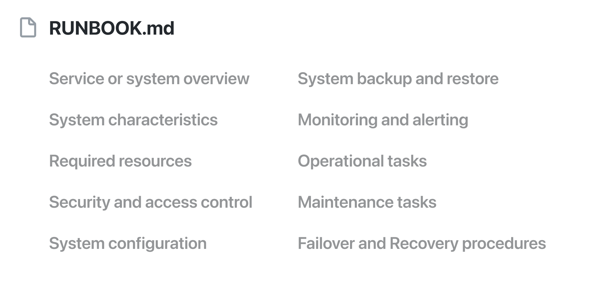

# Runbook

В 2016 году команда Skelton Thatcher Consulting опубликовала шаблон руководства по эксплуатации систем – Runbook:  
https://github.com/SkeltonThatcher/run-book-template/blob/master/run-book-template.md

Такой документ кладётся в репозиторий проекта, например как RUNBOOK.md, и отвечает на базовые вопросы: что это за проект, зачем он компании, какие у него внешние зависимости, как мониторить, как деполоить, какие бывают проблемы и как их решать и так далее. Я уже перевёл на него несколько проектов и результат продолжает радовать. Не нужно стараться написать всё сразу, к тому же, не все разделы могут иметь смысл для конкретного проекта.

Советую также взглянуть на их книгу «Team Guide to Software Operability» (не закончена):  
http://operabilitybook.com

#ops
