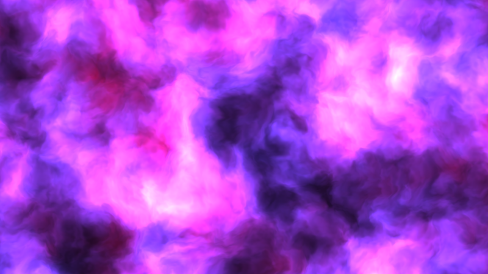

# Shaders



Roughly speaking, a shader is a program that takes in coordinates pixel, time,
cursor position, "screen" size, and returns a color, that the pixel should have.
Since neighboring pixels don't know about each other's state,
the shaders parallelize well.

https://www.khronos.org/opengl/wiki/Shader

Shaders are described in GLSL (OpenGL Script Language). For example,
to fill the screen with red color you can write:

```glsl
void main() {
  gl_FragColor=vec4(255, 0, 0, 1);
}
```

There are several services where you can "play around" with shaders
and see the result in real time:

* https://twigl.app
* https://glslsandbox.com
* https://shader-factory.herokuapp.com
* https://shadered.org/app?fork=4Y3P9GQID0

For those who want to dive deeper, I can recommend
[The Book Of Shaders](https://thebookofshaders.com) (in progress).

#image
