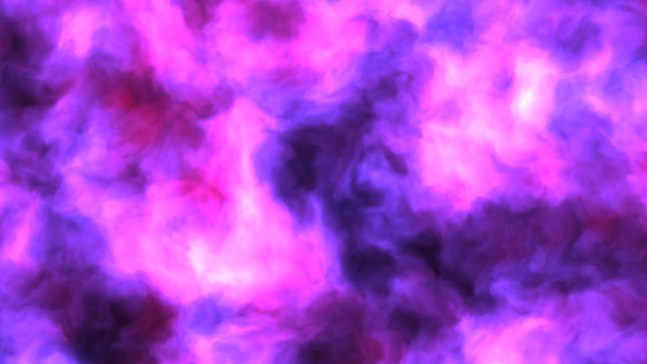

# Шейдеры



Грубо говоря, шейдер это программа, на вход которой поступают координаты
пикселя, время, позиция курсора, размер "экрана", а на выходе она отдаёт цвет,
который должен иметь пиксель. Так как соседние пиксели не знают
о состоянии друг друга, шейдеры хорошо параллелизуются.

https://www.khronos.org/opengl/wiki/Shader

Шейдеры описываются на языке GLSL (OpenGL Script Language). Например, чтобы
залить экран красным цветом можно написать:

```glsl
void main() {
  gl_FragColor=vec4(255, 0, 0, 1);
}
```

Есть несколько сервисов где можно "поиграться" c шейдерами и в реальном времени
увидеть результат:

* https://twigl.app
* https://glslsandbox.com
* https://shader-factory.herokuapp.com
* https://shadered.org/app?fork=4Y3P9GQID0

Для желающих погрузится глубже могу порекомендовать
[The Book Of Shaders](https://thebookofshaders.com/?lan=ru) (в процессе написания)
и акааунты в Твиттере:

* https://twitter.com/XorDev
* https://twitter.com/kamoshika_vrc
* https://twitter.com/zozuar
* https://twitter.com/catzpaw

#image
