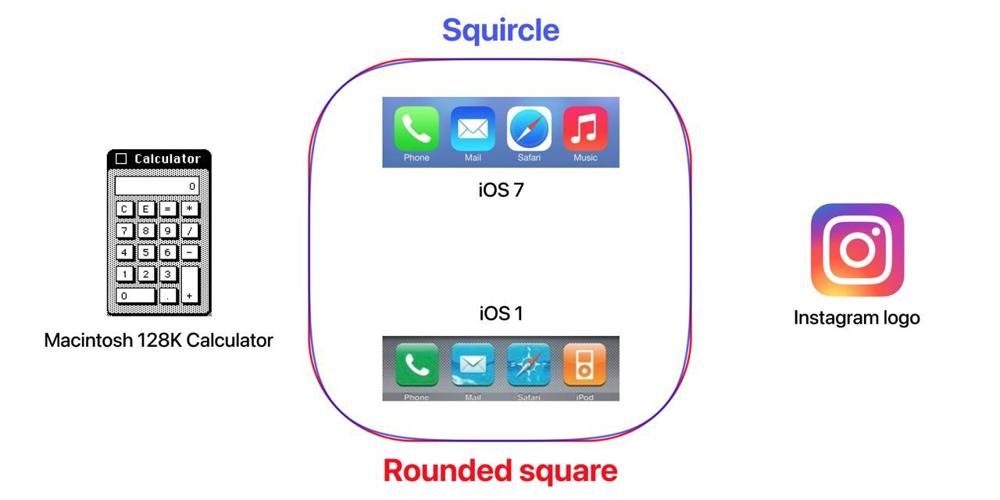

# Squircle

The first Mac, the Macintosh 128K, came out in 1984 with its first graphical interface. Some application windows and the top menu itself had rounded corners. There is a story where Steve Jobs insisted on this small detail:  
https://www.folklore.org/StoryView.py?story=Round_Rects_Are_Everywhere.txt

All icons in the first iPhone (2007) were squares, with rounded corners. But starting with iOS 7 (2013, the moment of abandoning skeo-morphism) Apple has made the rounded corners smoother. All thanks to the squircle shape – a shape somewhere between a square and a circle.
This curve of the border visually seems smoother and more natural.  
https://en.wikipedia.org/wiki/Squircle

Sometimes it is mistaken for a superellipse:  
https://en.m.wikipedia.org/wiki/Superellipse

Since recently, you can adjust the smoothing of corners in Figma.

#design
