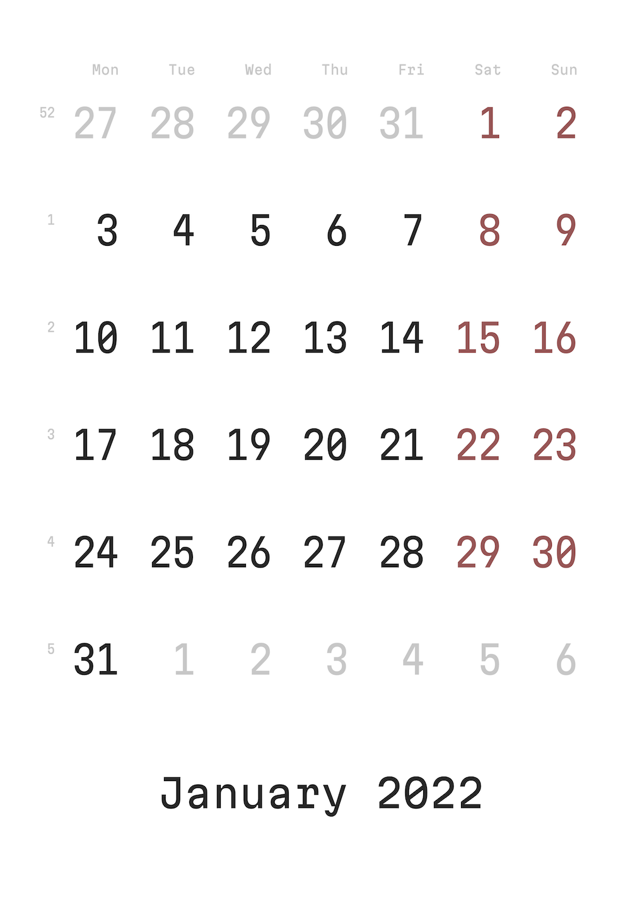

# Календарь 2022

На каждый новый год я делаю календарь.

В этом году вместо [Iosevka](https://github.com/be5invis/Iosevka) (OFL 1.1)
взял свежий [Martian Mono](https://github.com/evilmartians/mono) от
[Романа Шамина](https://twitter.com/romanshamin) (арт-директор
[Злых Марсиан](https://evilmartians.com)).

Martian Mono — бесплатный. Разработку можно поддержать [на Патреоне](https://patreon.com/romanshamin).

<a href="calendar.pdf" download="2022 Calendar.pdf">2022 Calendar.pdf</a>

#project #calendar #font
