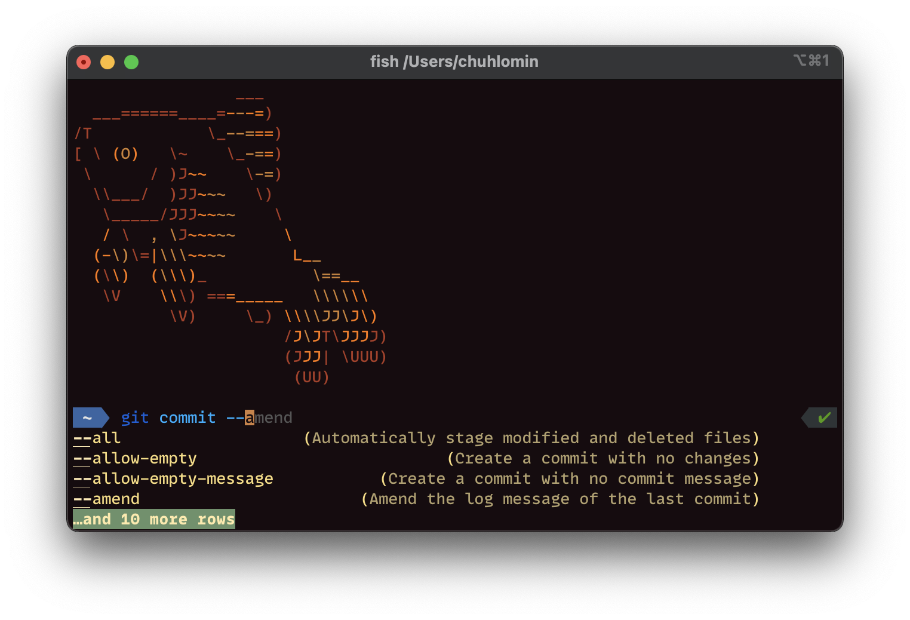

# Fish



For more than a year now, instead of Bash and Zsh, I have been using the "interactive friendly" Fish shell.

https://fishshell.com

https://github.com/fish-shell/fish-shell

When you start using Fish, the first thing you notice is that it's swift.
It's noticeably faster than Zsh.

[Fisher](https://github.com/jorgebucaran/fisher) – is one of the most common plugin managers for fish.

Recommended plugins: [tide](https://github.com/IlanCosman/tide),
[fish-async-prompt](https://github.com/acomagu/fish-async-prompt).

```bash
fisher install ilancosman/tide
fisher install acomagu/fish-async-prompt
```

Switch to fish!

```bash
brew install fish
chsh -s /usr/local/bin/fish
```

#cli
