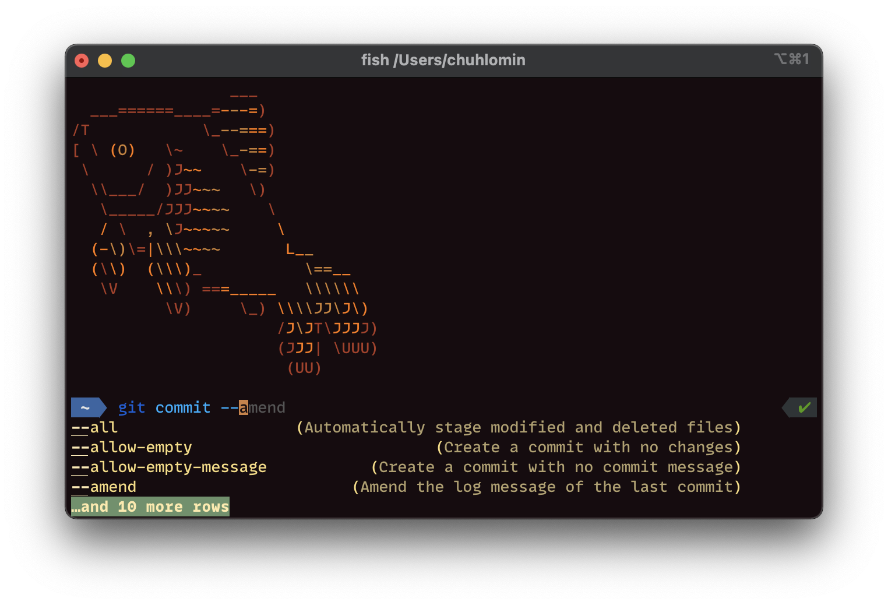

# Fish



Уже больше года вместо Bash и Zsh я пользусь "дружелюбной интерактивной" оболочкой Fish.

https://fishshell.com

https://github.com/fish-shell/fish-shell

Первое на что обращаешь внимание когда начинаешь пользоваться Fish – он очень быстрый.
Прямо на глаз быстрее чем Zsh.

[Fisher](https://github.com/jorgebucaran/fisher) – один самых из распространённых менеджеров плагинов для fish.

Рекомендую плагины: [tide](https://github.com/IlanCosman/tide),
[fish-async-prompt](https://github.com/acomagu/fish-async-prompt).

```bash
fisher install ilancosman/tide
fisher install acomagu/fish-async-prompt
```

Переходите на fish!

```bash
brew install fish
chsh -s /usr/local/bin/fish
```

#cli
