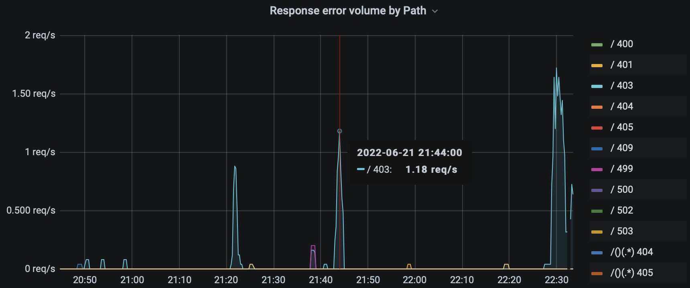

# Grafana

Grafana is an open-source app for visualizing and analyzing metrics.
It supports many data sources, including Prometheus, InfluxDB, and more.

https://grafana.com

https://github.com/grafana/grafana

From its release in 2014, it evolved into a much more powerful tool.
Now it can be used to:

* alert you when the metric is too high or too low via email, Slack, Telegram, PagerDuty, etc,
* browse logs from Loki, Elasticsearch, or CloudWatch,
* query distributed traces from Zipkin, Jaeger, or Tempo.

https://grafana.com/docs/grafana/latest/

Closest alternatives: [DataDog](https://www.datadoghq.com),
[Kibana](https://www.elastic.co/kibana/)

#ops #visualization #go
