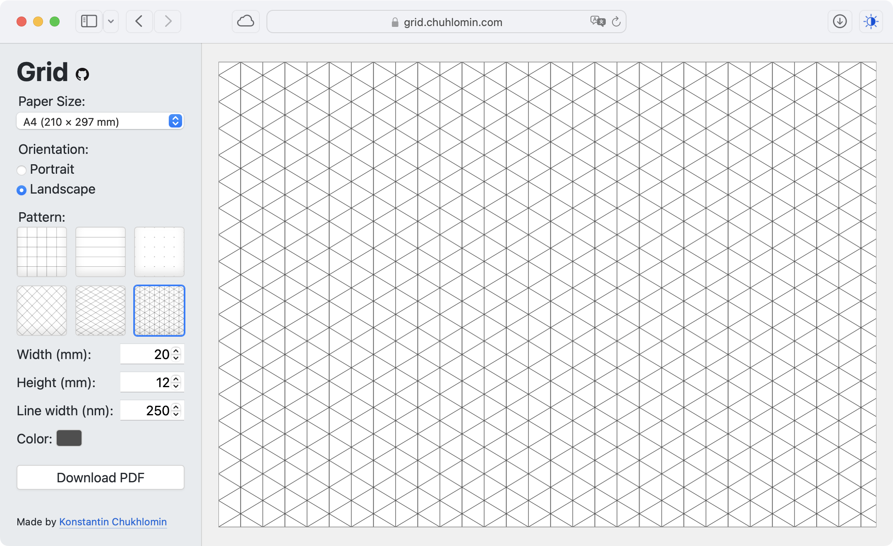

# Grid

Давно руки чесались сделать какой-нибудь генератор PDF-файлов с паттернами, и вот:

https://grid.chuhlomin.com

Выставил параметры в интерфейсе, нажал "Скачать" и получил файл для печати.

Можно выбрать:

* размер бумаги и ориентацию страницы
* паттерн, его размеры
* толщину линий и цвет

Особенно заморочился с версией для маленького экрана.

Всё это затевалось чтобы порисовать [изометрические карты](https://www.wistedt.net/tutorials/tutorial-isometric-dungeon-map/).

Print responsibly.

https://github.com/chuhlomin/grid

#project #go
