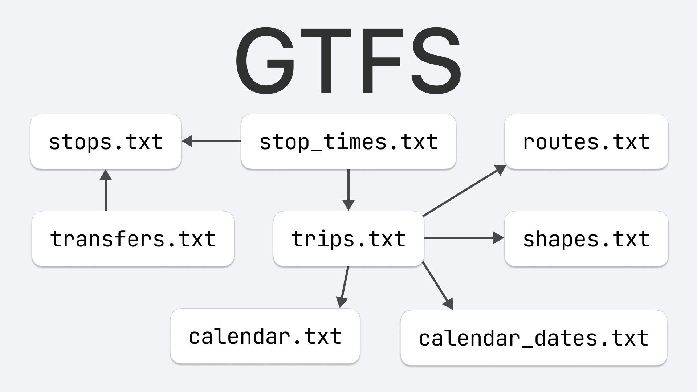

# GTFS

GTFS (General Transit Feed Specification) – отрытый формат для описания
расположения остановок, расписания движения и т.п.

https://gtfs.org

Он появился в результате сотрудничества Портлендского транспортного предприятия TriMet и Google
в 2005 году.

https://developer.trimet.org/GTFS.shtml

Для популяризации и контролем за развитием формата создана компания
Mobility Data.

https://database.mobilitydata.org

Более тысячи транспортных компаний предоставляют данные
в этом формате разработчикам и компаниям.
Распространяются данные в виде ZIP архива с CSV файлами: `stops.txt`,
`routes.txt`, `trips.txt`, `shapes.txt`, `calendar.txt`, ...

https://developers.google.com/transit/gtfs/reference

Особенно любопытно для меня выглядит расширение формата GTFS-Pathways
(`pathways.txt`), описывающее многоуровневые станции, пересадки и зоны посадки.

https://docs.google.com/document/d/1qJOTe4m_a4dcJnvXYt4smYj4QQ1ejZ8CvLBYzDM5IyM

#transit #geo
