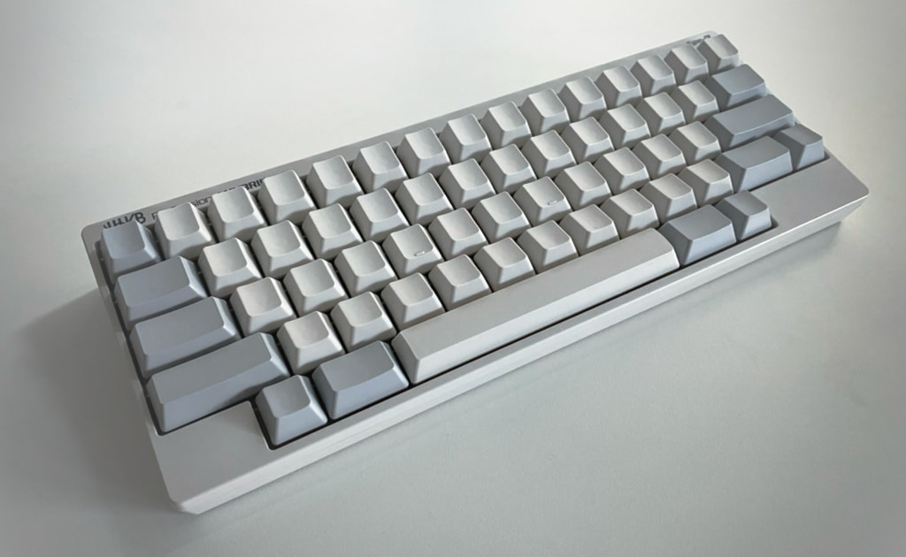
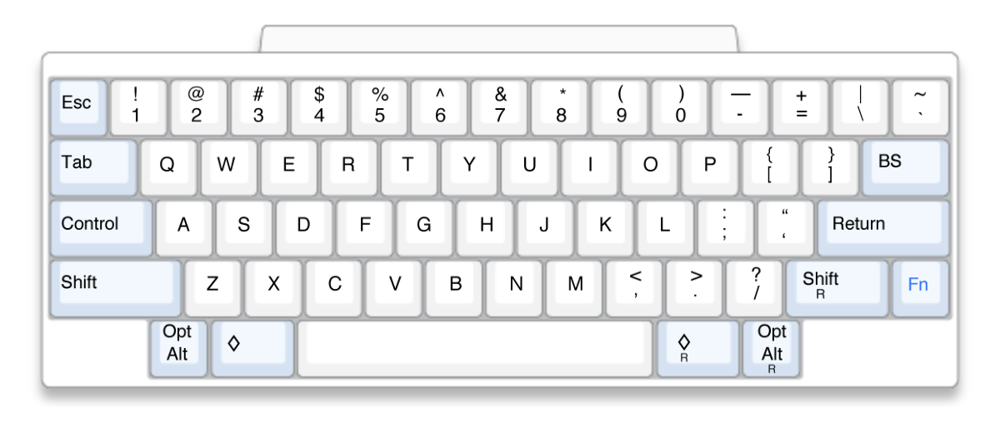
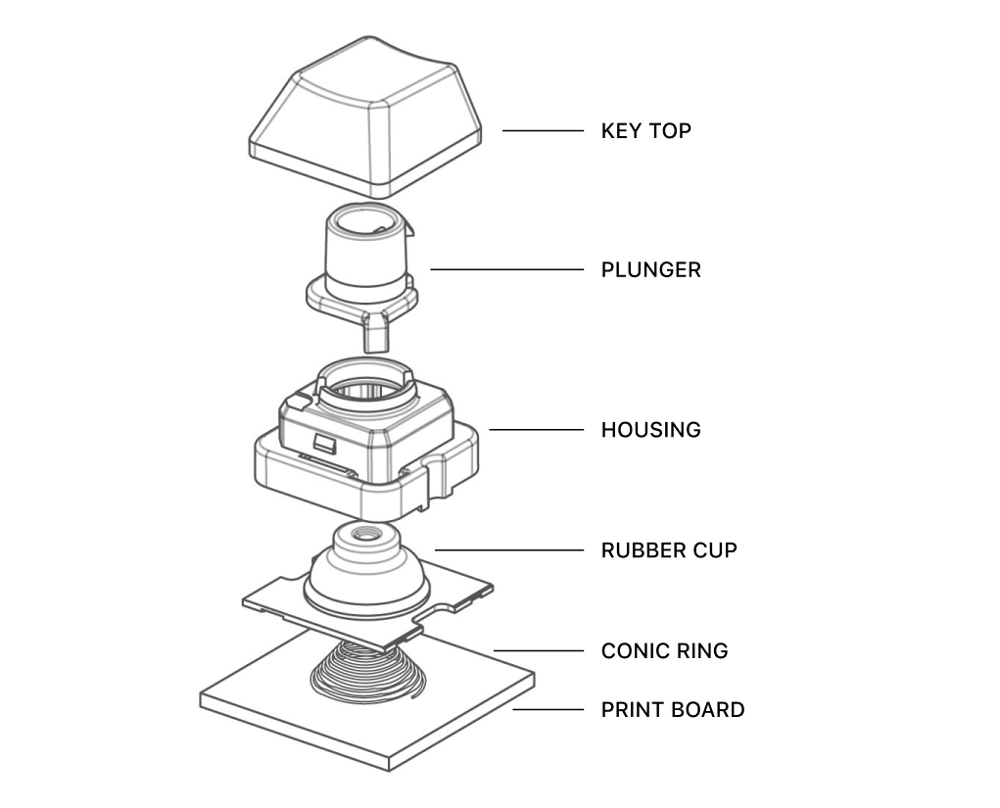
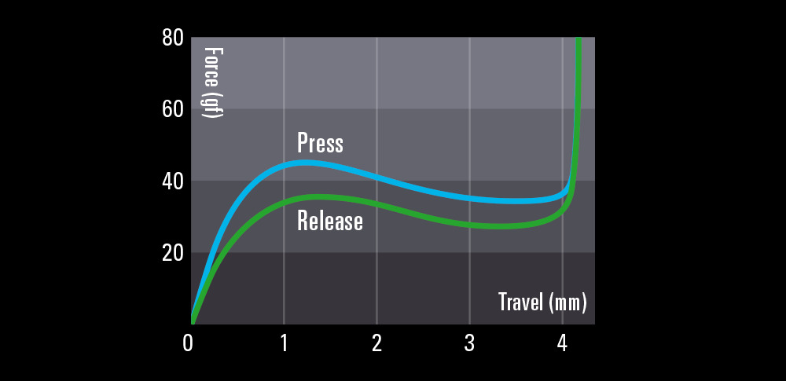

# HHKB

In 1996 the Japanese computer scientist Eiiti Wada designed Happy Hacking Keyboard,
a minimalistic keyboard with 60 keys. It is produced in Japan by PFU Limited,
a subsidiary of Fujitsu.

https://hhkeyboard.us

The keyboard design is inspired by the keyboard of the first Macintosh 128k:
no function keys and cursor keys, <kbd>Control</kbd> instead of <kbd>CapsLock</kbd>.

This does not mean that you cannot control the cursor, press <kbd>F2</kbd>, or change the
volume — these functions are performed by the existing keys with held down <kbd>Fn</kbd> key.

The current generation HHKB Professional Series can either connect via USB
Type-C or Bluetooth, runs on two AA batteries, and remembers up to four devices.

What makes the HHKB different from most mechanical keyboards is the Topre's
electrostatic capacitive switches. They detect key presses using a spring
located directly on the circuit board rather than passing a current through them.
The spring allows the keys to return to their original position faster,
they don't rattle as much, and they sound different.

If the lack of arrow keys seems wild, look at the Leopold FC660C.

#keyboard #hardware
