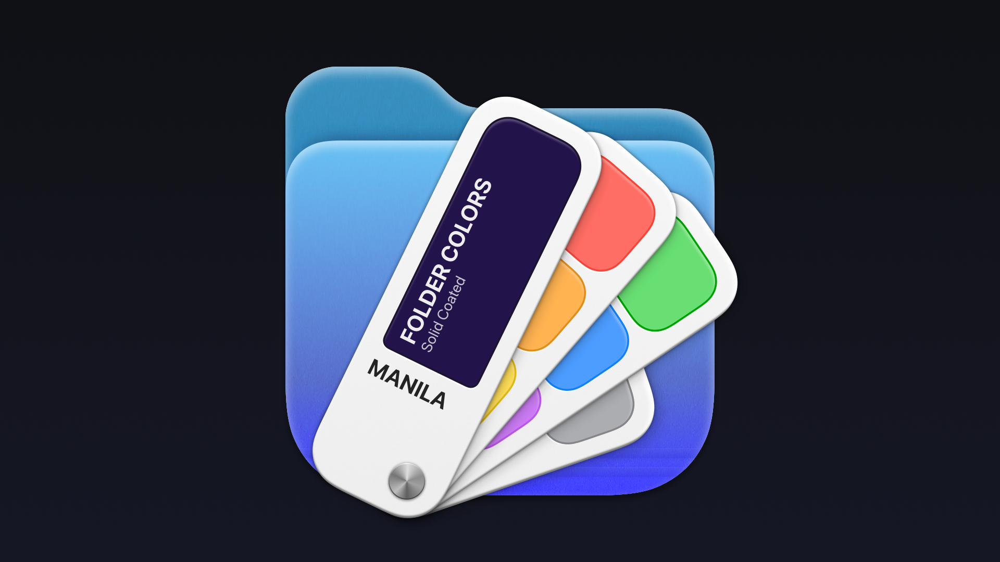

# Manila

Манильская пенька́, также известная как "абака", это грубое волокно используемое
при изготовлении канатов. Веращивается оно на Филиппинах, отсюда и ассоциация
с Манилой – столицей страны.

Манильская бумага первоначально изготавливалась из старых канатов,
которые широко использовались на кораблях. Из этой бумаги светло-жёлто-коричневого
цвета делают папки и конверты. Именно этого цвета папки в Windows.

[Neil Sardesai](https://twitter.com/neilsardesai) сделал расширение для Finder
которое позволяет менять цвет папки через контекстное меню.

> Стандартная синяя папка - это очень красиво. Но хотелось ли вам когда-нибудь
> иметь красную папку? Или зеленую? А может быть, даже фиолетовую?
> Что ж, теперь вы можете –

https://github.com/neilsardesai/Manila

<video controls>
  <source src="manila.mp4" type="video/mp4">
</video>

#app #macos
