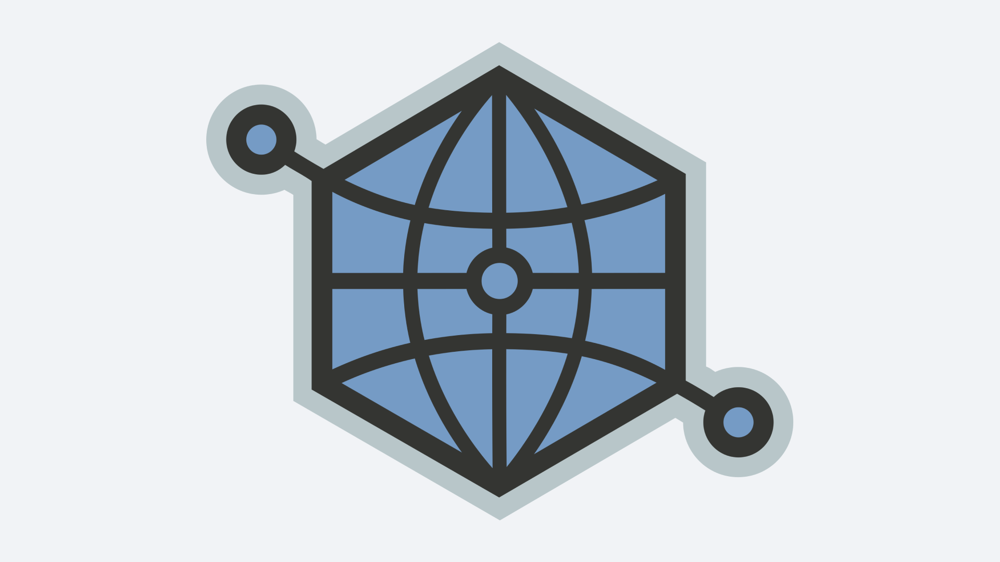

# Open Graph Protocol



Open Graph это протокол, призванный повлиять на то как должена выглядеть ссылка,
когда ей делятся в интернете.

https://ogp.me

С помощью специальных HTML `meta`-тегов можно задать заголовок, описание,
картинку и другую информацию о странице.

Теперь все посты в этом блоге имеют эти теги. Например, для этой страницы они
выглядят так:

```html
<meta property="og:type" content="article">
<meta property="og:url" content="https://chuhlomin.com/blog/2022/ogp.html?lang=ru">
<meta property="og:title" content="Open Graph Protocol \ Микроблог \ Константин Чухломин">
<meta property="og:image" content="https://chuhlomin.com/blog/2022/ogp.png">
<meta property="article:author" content="https://chuhlomin.com">
<meta property="article:published_time" content="2022-05-21">
<meta property="article:tag" content="blog">
```

Несколько полезных инструментов:

* [Open Graph Generator](https://webcode.tools/generators/open-graph)
* [Twitter Card Validator](https://cards-dev.twitter.com/validator)
* [Twitter Card Preview Tool](https://www.bannerbear.com/tools/twitter-card-preview-tool/)
* [Facebook Preview Tool](https://www.bannerbear.com/tools/facebook-open-graph-preview-tool/)

#blog
