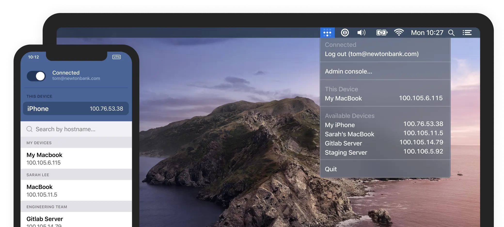

# Tailscale

Tailscale creates a secure network between your servers, computers, cloud instances. For example, a virtual machine in the cloud can directly retrieve data from a light sensor available on your home network. Or, you can set it up so that all traffic from your phone goes through this virtual machine, no matter where you are.

https://tailscale.com

Tailscale is easy to set up and is available on most platforms: MacOS, iOS, Windows, Linux.
https://tailscale.com/download/

Free for personal use, add up to 20 devices to the network.
https://tailscale.com/pricing/

Tailscale is based on Wireguard - an open and secure data transfer protocol, an alternative to OpenVPN.

https://www.wireguard.com

https://vladtalks.tech/vpn/is-wireguard-faster-than-openvpn

#app #ops
