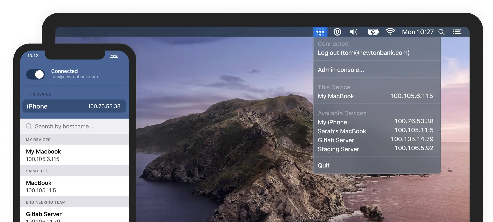

# Tailscale

Tailscale объединяет устройства в одну приватную сеть (VPN).
Так, например, вирутальная машина в облаке может напрямую забирать данные с датчика света, доступном в домашней сети. Или, можно настроить так, чтобы весь трафик с телефона шёл через эту виртуальную машину, независимо от того, где вы находитесь.

https://tailscale.com

Tailscale прост в настройке и доступен на большинстве платформ: MacOS, iOS, Windows, Linux.
https://tailscale.com/download/

Подойдёт для развёртывания корпоративного VPN.
А для бесплатного личного использования в сеть можно добавить до 20 устройств.
https://tailscale.com/pricing/

Работает Tailscale на основе Wireguard – открытого и безопасного протокола передачи данных, альтернативе OpenVPN.

https://www.wireguard.com

https://vladtalks.tech/vpn/is-wireguard-faster-than-openvpn

#app #ops
