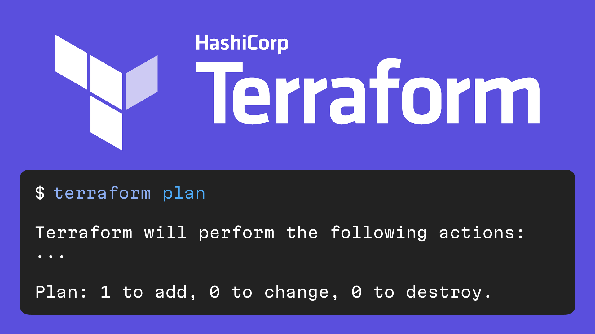

# Terraform

Terraform is a Hashicorp tool that allows configuring external services with config files.

https://www.terraform.io
https://github.com/hashicorp/terraform

For any service that provides external API, you can write a "provider." Terraform provider defines what "resources" can be configured in this service.

There are already official providers for popular services:

- [AWS](https://registry.terraform.io/providers/hashicorp/aws/latest/docs)
- [GitHub](https://registry.terraform.io/providers/integrations/github/latest/docs/)
- [Fastly](https://registry.terraform.io/providers/fastly/fastly/latest/docs)
- [DataDog](https://registry.terraform.io/providers/DataDog/datadog/latest/docs)
- [Terraform Cloud](https://registry.terraform.io/providers/hashicorp/tfe/latest/docs)

To understand what changed since the last run, Terraform needs to store the state of the resources in a file, S3 bucket, or somewhere else.

If you don't want to deal with configuring CI/CD and storing the state, Hashicorp provides a service called [Terraform Cloud](https://cloud.hashicorp.com/products/terraform).

Unfortunately, Terraform does not yet know how to generate configuration files for already configured services.
But you can use [Terraformer](https://github.com/GoogleCloudPlatform/terraformer) for that.

There are a few other tools that can make life with Terraform better:

- [tflint](https://github.com/terraform-linters/tflint)
- [tfsec](https://github.com/aquasecurity/tfsec)
- [terratest](https://github.com/gruntwork-io/terratest)

#ops #go
