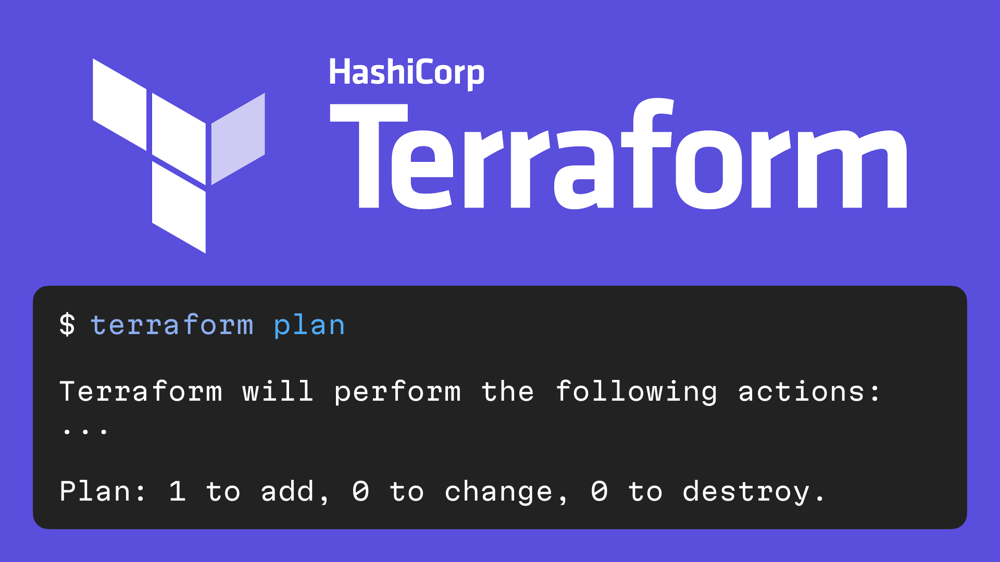
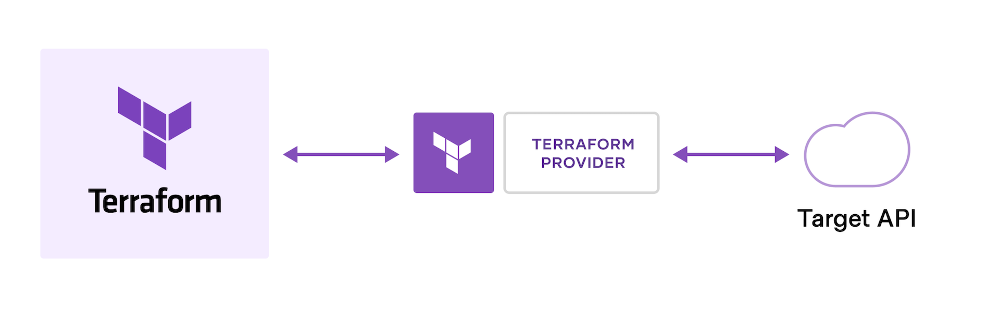

# Terraform

Terraform это инструмент от Hashicorp который позволяет настраивать внешние
сервисы с помощью конфигурационных файлов.

https://www.terraform.io  
https://github.com/hashicorp/terraform

Для любого сервиса который отдаёт наружу API можно написать "провайдера" Terraform.
Провайдер опеределяет какие "ресурсы" можно настраивать в этом сервисе.

А для популярных сервисов уже есть официальные провайдеры:

- [AWS](https://registry.terraform.io/providers/hashicorp/aws/latest/docs)
- [GitHub](https://registry.terraform.io/providers/integrations/github/latest/docs/)
- [Fastly](https://registry.terraform.io/providers/fastly/fastly/latest/docs)
- [DataDog](https://registry.terraform.io/providers/DataDog/datadog/latest/docs)
- [Terraform Cloud](https://registry.terraform.io/providers/hashicorp/tfe/latest/docs)

Чтобы понимать, что изменилось с последнего запуска, Terraform нужно где-то хранить
"состояние": в локальном файле, или в S3-бакете или где-то ещё.
Если не хочется заморачиваться с настройкой CI/CD и хранением состояния,
Hashicorp предоставляет облачный сервис [Terraform Cloud](https://cloud.hashicorp.com/products/terraform).

К сожалению, Terraform пока не умеет генерировать конфигурационные файлы по
уже настроенным сервисам.
Для этого есть [Terraformer](https://github.com/GoogleCloudPlatform/terraformer).

Есть ещё несколько инструментов которые могут сделать жизнь с Terraform лучше:

- [tflint](https://github.com/terraform-linters/tflint)
- [tfsec](https://github.com/aquasecurity/tfsec)
- [terratest](https://github.com/gruntwork-io/terratest)

#ops #go
