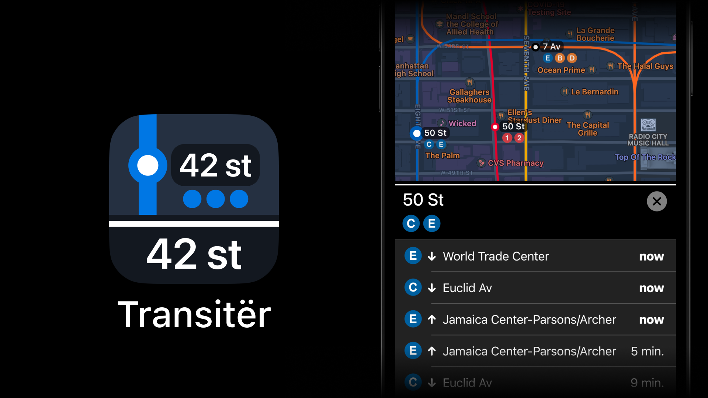

# Transitër

In 2019 I wrote an app for iOS - Transit Ninja.
The idea is simple: the map shows the locations of the nearest bus stops and subway stations.
Click on the icon and see what buses or trains are coming.

The same year, Apple announced [SwiftUI](https://developer.apple.com/xcode/swiftui/) – a new way to create app interfaces.

It took me four months to rewrite my app in SwiftUI.

Promo site: https://transiter.app

The app only works for NYC subways, buses, and New Jersey trains.

https://apps.apple.com/us/app/transitër/id1472885958

#project #ios #transit
