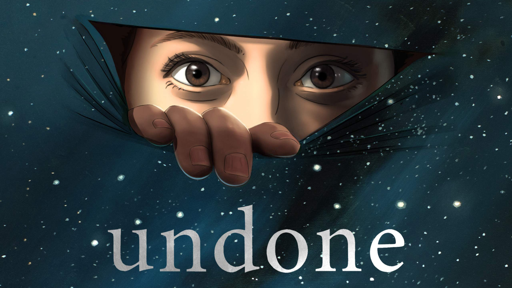
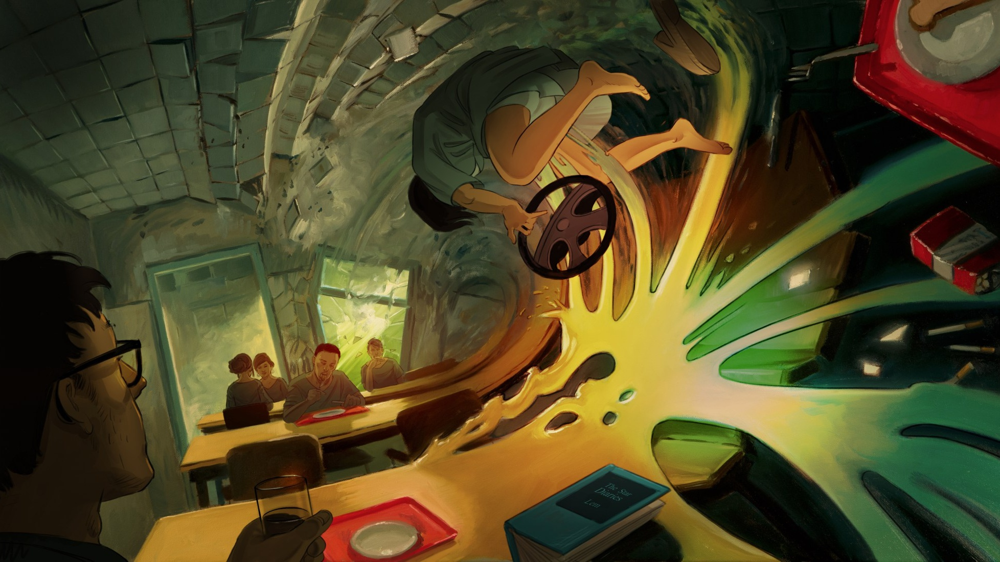

# Undone

The series on Amazon Prime Video tells the story of a girl named Alma.
After surviving a car accident, she sees the “ghost” of her long-dead
father and discovers the ability to manipulate time.

The series uses rotoscoping – an animation technique in which filmed
actors are redrawn frame by frame.

2 seasons, 8 episodes each. 1 eposiode ≈ 30 minutes.

https://www.amazon.com/gp/video/detail/B07XCBY12H

#tvshow
