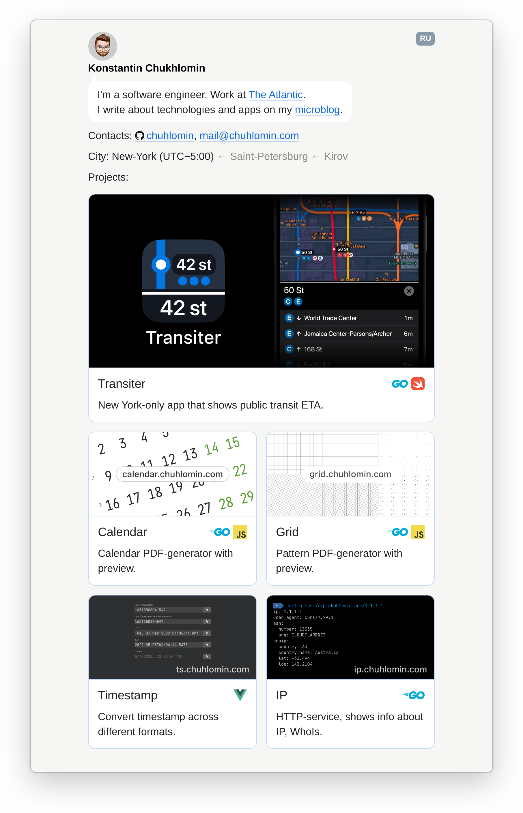

# chuhlomin.com

[](https://github.com/chuhlomin/homepage/actions/workflows/main.yml)
[](https://github.com/chuhlomin/homepage/actions/workflows/links.yml)

Powers https://chuhlomin.com



## Directory structure

```bash
.
├── content
│   ├── blog
│   │   ├── 2020
│   │   │   └── castty.md
│   │   ├── 2021
│   │   ├── 2022
│   │   ├── 2023
│   │   └── index.gohtml
│   ├── experiments
│   ├── fonts
│   ├── img
│   ├── styles.css
│   └── index.gohtml
├── generator # Go app
├── i18n      # translations
└── templates # Go templates used by generator
```

## Local development

Pre-requisites:

- [Go](https://go.dev/doc/install)
- [Caddy](https://caddyserver.com/docs/install)

```bash
# Start MeiliSearch
docker compose up search -d

# In a separate terminal start Caddy
caddy run

# Build static site and update search index
# (will create `output` directory with generated static files)
make build
```

Example output:

```text
Building generator...
Running generator...
INFO Starting
INFO Waiting for images to be processed...
INFO Waiting for search index to be updated...
INFO Finished in 4.174840792s
```


Open https://local.chuhlomin.com

See [main.go](generator/main.go) for more configuration options.

Environment differencies:

|             | Local                                   | Production                   |
|-------------|-----------------------------------------|------------------------------|
| Host        | https://local.chuhlomin.com             | https://chuhlomin.com        |
| Search host | https://local.chuhlomin.com/blog/search | https://search.chuhlomin.com |

## CloudFlare Pages specifics

https://developers.cloudflare.com/pages/platform/serving-pages/

> If an HTML file is found with a matching path to the current route requested,
> Pages will serve it. Pages will also redirect HTML pages to their extension-less
> counterparts: for instance, /contact.html will be redirected to /contact,
> and /about/index.html will be redirected to /about/.

To avoid redundant redirects all links should be without `.html` extension.
See `REMOVE_HTML_EXT` in [main.go](generator/main.go) and `link` in [templates.go](generator/templates.go).

### Transform Rules

To support links to pages in different languages, these Transform Rules should be added to CloudFlare Pages:

- `(http.request.uri.query eq "lang=ru" and http.request.uri.path in {"/" "/blog" "/blog/2020" "/blog/2021" "/blog/2022" "/blog/2023"})`→ `concat(http.request.uri.path, "/index_ru")`
- `(http.request.uri.query eq "lang=ru" and not http.request.uri.path in {"/" "/blog" "/blog/2020" "/blog/2021" "/blog/2022" "/blog/2023" "/blog/feed.atom"})` → `concat(http.request.uri.path, "_ru")`

It's an equivalent to this Caddy config:

```caddy
@langRu {
	query lang=ru
	file {
		try_files {path}/index_ru.html {path}_ru.html
	}
}
rewrite @langRu {http.matchers.file.relative}
```

The request flow for new links:

- URL `/blog/2020/castty?lang=ru`
- Transform Rule changes it to `/blog/2020/castty_ru`
- Pages serves `/blog/2020/castty_ru.html`

### Redirects

To redirect old links to links without `.html` extension, these `_redirects` should be added to CloudFlare Pages:

```text
/index.html / 301
/index.html_ru /?lang=ru 301
/blog/index.html /blog 301
/blog/index.html_ru /blog?lang=ru 301

/blog/2020/castty.html /blog/2020/castty 301
/blog/2020/castty.html_ru /blog/2020/castty?lang=ru 301
```

The request flow for old links:

- Old URL `/blog/2020/castty.html?lang=ru`
- Transform Rule changes it to `/blog/2020/castty.html_ru`
- `_redirects` changes it to `/blog/2020/castty?lang=ru`
- Transform Rule changes it to `/blog/2020/castty_ru`
- Pages serves `/blog/2020/castty_ru.html`

Other redirects handle year pages.

```text
/blog/2020 /blog/#2020 301
/blog/2020/ /blog/#2020 301
/blog/2020/_ru /blog?lang=ru#2020 302
/blog/2020/index_ru /blog?lang=ru#2020 302
```

Example redirects:

- /blog/2022 → /blog/#2022
- /blog/2022/ → /blog/#2022
- /blog/2022?lang=ru → /blog/?lang=ru#2022

Redirects to address the case when I typed my domain and then realized
that I forgot to add subdomain:

```text
/grid https://grid.chuhlomin.com 302
/calendar https://calendar.chuhlomin.com 302
/transiter https://transiter.app 302
```

Lastly, there just handly URLs to share:

```text
/github https://github.com/chuhlomin 302
/instagram https://www.instagram.com/chuhlomin 302
```

### Feed.atom

To support language-specific feeds, this Transform Rules should be added to CloudFlare Pages:

`(http.request.uri.query eq "lang=ru" and http.request.uri.path eq "/blog/feed.atom")` → `blog/feed_ru.atom`

Example of the feed: /blog/feed.atom?lang=ru
