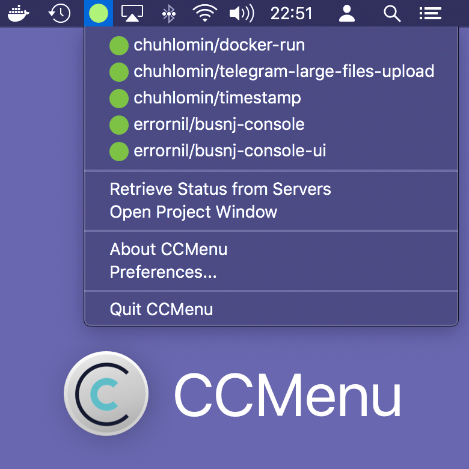

# CCMenu

There was a continuous integration (CI) tool – CruiseControl (2001-2010).
Written by ThoughtWorks, the BSD-licensed open-source project got a lot of publicity.
http://cruisecontrol.sourceforge.net

They came up with the CCTray format, which has become the de facto standard for describing the status of projects in CI systems:
https://cctray.org/v1/

Travis, Jenkins, TeamCity, Drone CI, and many others provide special URLs where they give information about the status of builds.
In Drone CI, that understandably only works for public projects.

Another side of the matter is to make this information available to the user in a convenient form.
On macOS, a program called CCMenu does this (see screenshot).

http://ccmenu.org

**Update 2024-09-01**: CCMenu now supports GitHub Actions.

#ops #app #macos
