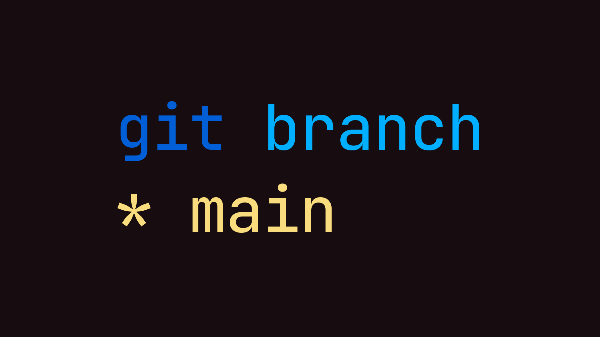

# Git: main



In Git, starting with the latest version 2.28, there is an option to change
the default branch name from `master` to something else, such as `main`:

```bash
git config --global init.defaultBranch main
```

What attracts me to this solution is that main is shorter and "rhymes"
with things from the Go world: `main.go`, `package main`, `func main`.

In general, switch to main in new projects.

```bash
git branch -m master main
git fetch origin
git branch -u origin/main main
```

#git