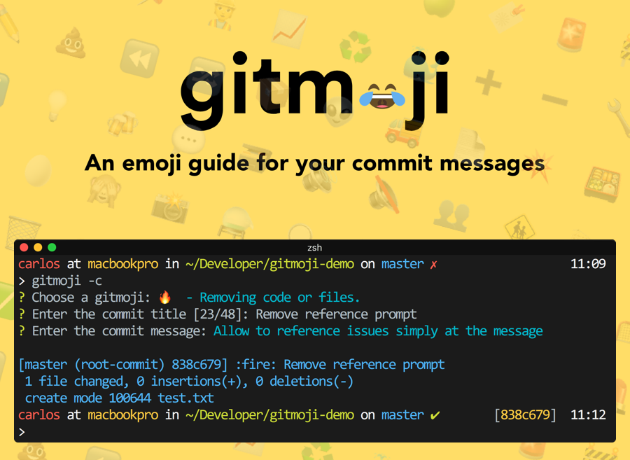

# Gitmoji

Как-то я пропустил такую штуку как Gitmoji (с 2016).
Это такой «справочник» по эмоджи для коммит-сообщений.

https://gitmoji.carloscuesta.me

Например, если коммит исправляет какой-то баг, то предлагается писать префикс «🐛» к сообщению.  
Или «🔥» если удаляется какой-то код или файлы. Это позволяет легко определить цель коммита взглянув только на используемый эмоджи.

Это проект с открытым исходным кодов, в составлении списка уже поучаствовали 44 человека.  
Особенно мило что сами коммиты к этому файлу уже следуют этим гайдлайнам:
https://github.com/carloscuesta/gitmoji/blame/master/src/data/gitmojis.json

Также обратите внимание, что по клику на эмоджи на сайте он копируется в буфер обмена.

А если не хочется всегда ходить на сайт – есть `gitmoji-cli`, который служит «оболочкой» над git commit (см. скриншот).

https://github.com/carloscuesta/gitmoji-cli (MIT)

#git #emoji #interface
