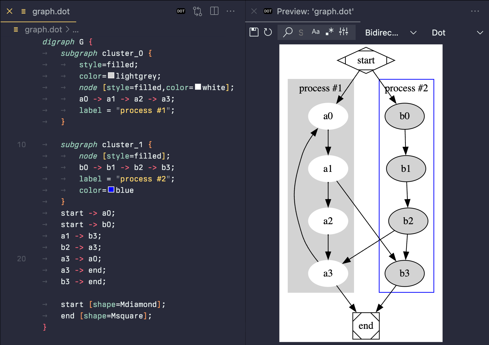
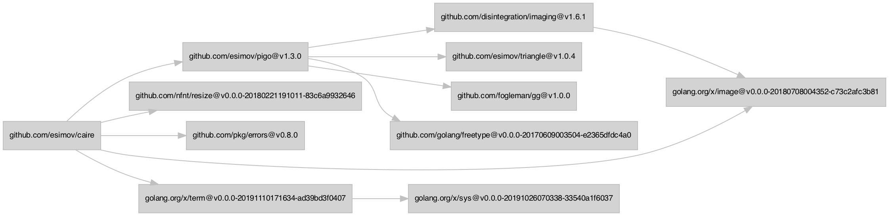

# Graphviz

Для тех, кто не знает [что такое графы](https://ru.wikipedia.org/wiki/Граф_(математика)),
вкратце, это набор вершин в связей (ребер) между ними.
С помощью графов можно представить схему метро, структуру организации,
карту путей NPC в какой-нибудь игре, ERD.

Graphviz – отличный инструмент визуализации структурированных данных в виде графов и сетей.

https://graphviz.org

Dot (одна из программ в наборе) умеет конвертирать направленные графы описанные в формате Dot в изображение (PNG, SVG), стараясь чтобы ребра пересекались как можно меньше. https://graphviz.org/doc/info/lang.html

```bash
dot -Tsvg -o graph.svg graph.dot
```



На скриншоте – работа плагина для VSCode: https://marketplace.visualstudio.com/items?itemName=tintinweb.graphviz-interactive-preview

Кстати, есть у меня такой небольшой сниппет для визуализации графа зависимостей в Go-проектах:

```bash
echo "digraph {
rankdir = LR
node [shape=rectangle fontname=GoMono fontsize=10 style=filled color=gray fillcolor=lightgray ]
edge [color=gray]
nodesep = 0.2
`go mod graph | awk '{ print \"\\"" $1 "\\" -> \\"" $2 "\\"\" }'`
}" | dot -Tsvg > dependency_graph.svg
```

Вот пример такого графа для проекта https://github.com/esimov/caire

[](dependency_graph.png)

#visualization #go
