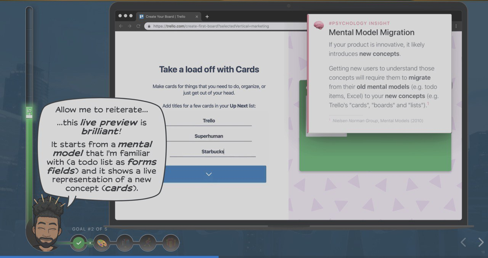

# Growth.Design

Категорически рекомендую посмотреть на работы Growth.Desing (пара ребят из Менреаля).

В разделе Case Studies они обозревают популярные сайты и приложения (Tinder, airbnb, Trello, ...).
Указывают на плюсы и минусы тех или иных решений в контексте UX и роста компании.
Подкрепляют свои доводы ссылками на источники и примеры.

⚡️ https://growth.design/case-studies/

Чем-то похоже на UserOnboard, но с уклоном в развитие бизнеса
https://www.useronboard.com/user-onboarding-teardowns/

Недавно они запустили новый раздел (который еще дописывают): «Психология дизайна: 101 когнитивное искажение и принципы которые влияют на ваш UX».

🧠 https://growth.design/psychology/

#site #design #interface
