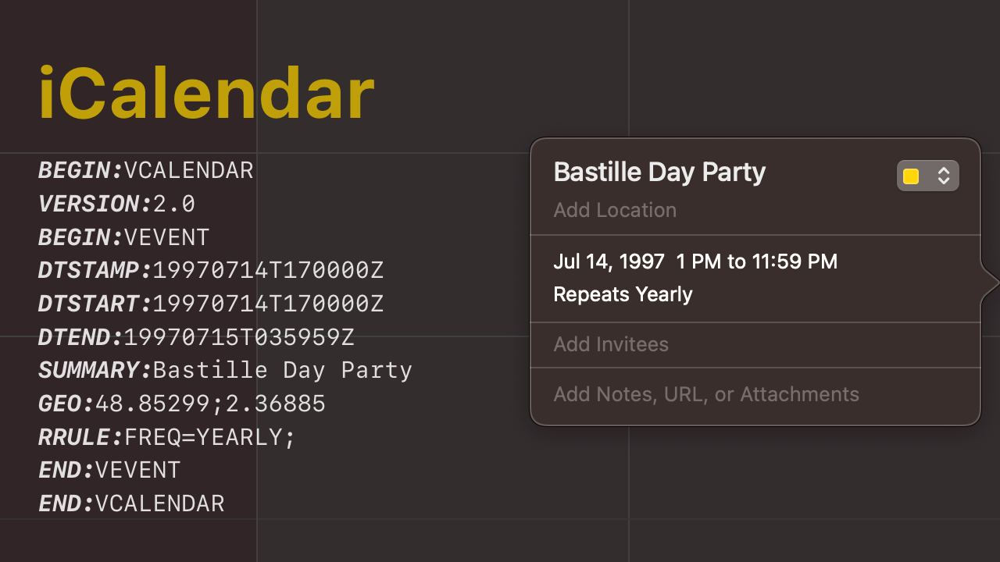

# iCalendar

The events in your calendar are most likely stored in iCalendar (.ics) format.  
https://en.wikipedia.org/wiki/ICalendar

The recurrent rule (RRULE/RECUR) format was invented to describe how often an event recurs. RRule itself is pretty flexible, allowing you to set rules like "every Saturday in January at 8:30 and 9:30 am every other year:
`RRULE:FREQ=YEARLY;INTERVAL=2;BYMONTH=1;BYDAY=SU;BYHOUR=8,9;`
https://tools.ietf.org/html/rfc5545

For RRule parsing, I found several libraries:

- JS: https://github.com/jakubroztocil/rrule
- Go: https://github.com/JulienBreux/rrule-go
- Python: http://labix.org/python-dateutil/

#rfc #calendar
