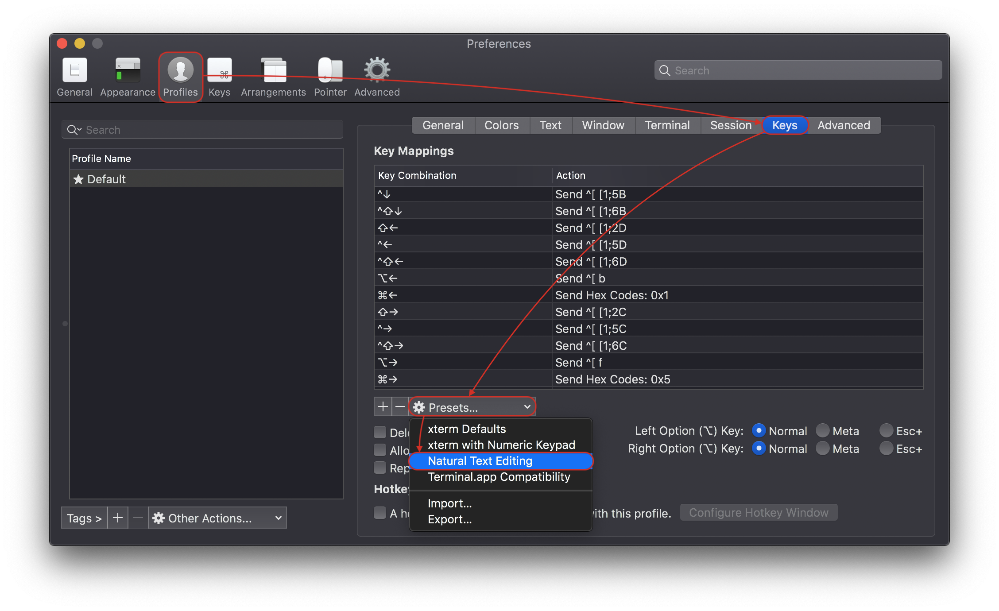

# iTerm2

Если вы проводите много времени в терминале на macOS, то наверняка пользуетесь iTerm2 — полноценной заменой системного Терминала с кучей фич:

https://iterm2.com/features.html

https://iterm2.com/downloads.html

Я пользуюсь им уже много лет, но совсем недавно обнаружил что с помощью пары кликов можно сделать то, что я настраивал себе и всем вокруг вручную: Natural Text Editing (см видео и скриншот).

<video width="760" height="490" controls>
  <source src="iterm2.mp4" type="video/mp4">
</video>

Суть в том что вместо классических комбинаций вроде
"<kbd>Control</kbd>+<kbd>A</kbd>", "<kbd>Control</kbd>+<kbd>E</kbd>",
"<kbd>Esc</kbd>, <kbd>b</kbd>", "<kbd>Esc</kbd>, <kbd>f</kbd>"
можно использовать интуитивно понятные и запоминаемые комбинации из текстовых редакторов:
"<kbd>⌘</kbd>+<kbd>←</kbd>", "<kbd>⌘</kbd>+<kbd>→</kbd>",
"<kbd>⌥</kbd>+<kbd>←</kbd>", "<kbd>⌥</kbd>+<kbd>→</kbd>".

#app #macos
