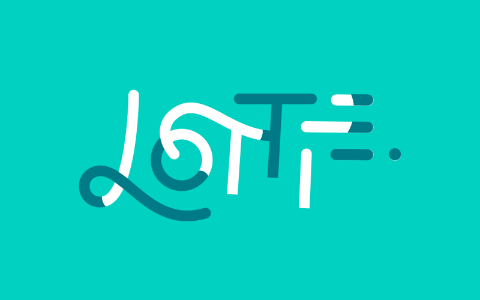

# Lottie

Let's continue with Telegram stickers.
Instead of WebP for animated stickers, a format called Lottie, developed at AirBnB (remember, you could still travel to other countries before?), was chosen.

https://airbnb.io/lottie/

The main difference is that it is a vector animation and therefore tends to be smaller in size. Examples of animations: https://lottiefiles.com

The primary way to create these animations is in the paid Adobe After Effects with the plugin Bodymovin, which makes a JSON file. Any animated sticker in Telegram is a zipped JSON file in Lottie format.

https://core.telegram.org/animated_stickers

JS library to show animations on the site
https://github.com/airbnb/lottie-web

Online editor for creating animations:
https://www.lottielab.com

#telegram
