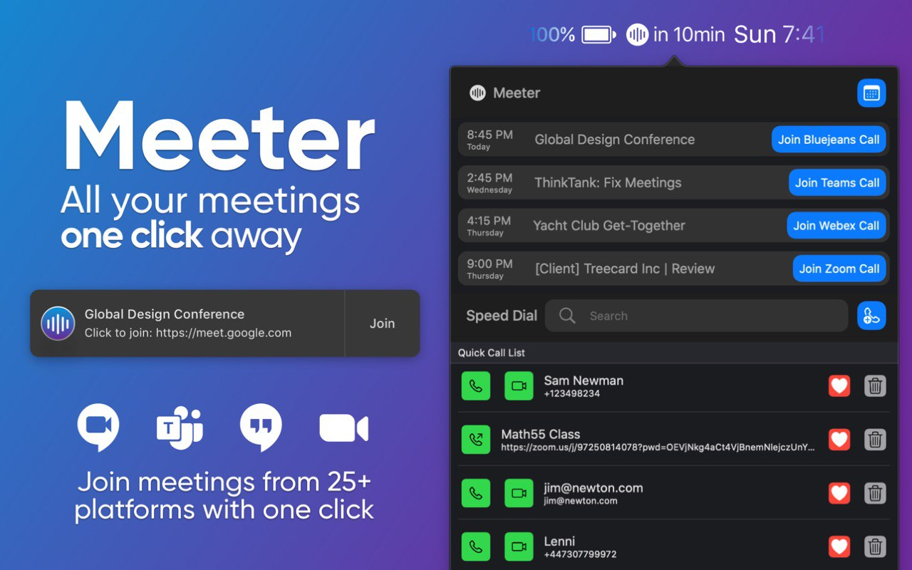

# Meeter

Если ваша работа связана с регулярными созвонами онлайн, то вам, наверное, знакомо то раздражение, которое возникает когда нужно быстро найти ссылку на «митинг» в почте или календаре, вы ее нажимаете, возможно, открывается новая вкладка браузера, где написано «открывается приложение...». И потом еще нужно закрыть эту вкладку, а не то их может скопится к концу рабочего дня.

3 студента из Европы (+ко-фаундер) сделали приложение Meeter, которое:

* висит в меню баре (по нажатию на иконку показывает митинги со звонками на сегодня),
* показывает обратный отсчет до следующего митинга,
* посылает нотификации за пару минут до митинга с простой кнопкой «Join»,
* работает с Zoom, Google Meet, Teams и другими.

Чтобы это все работало приложение просит доступ к календарю.
Но откажите в доступе к контактам – они не нужны для функционирования приложения (как приложение само и сообщает).

«Пока» бесплатно.

https://trymeeter.com

https://apps.apple.com/us/app/meeter-join-meetings-faster/id1510445899

#app #macos
