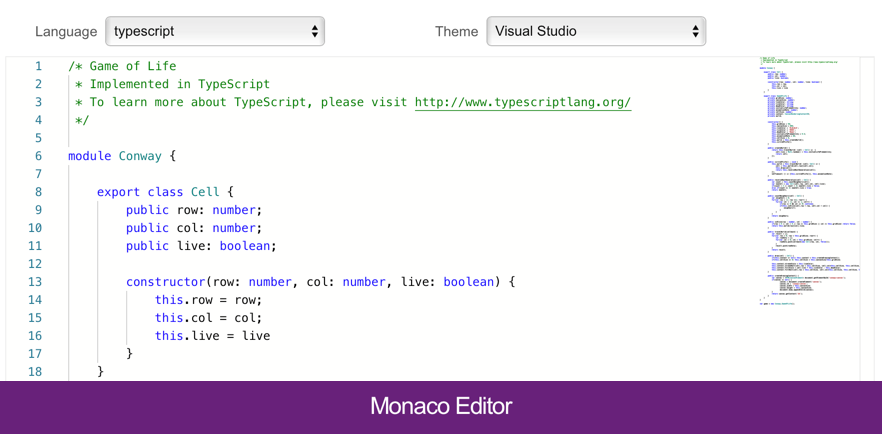

# Monaco Editor

Now my main editor in which I write code in VSCode.
I recently found out that Microsoft provides JS library Monaco Editor – a "trimmed" version of VSCode, only editor with mini-map, highlighting, and many other little things.

https://github.com/Microsoft/monaco-editor

https://microsoft.github.io/monaco-editor/index.html

Perfect if you make an online code editor or if you need to show the difference between two JSONs with highlighting. I can recommend it to those who have used Code Mirror before: https://codemirror.net

#vscode #js
