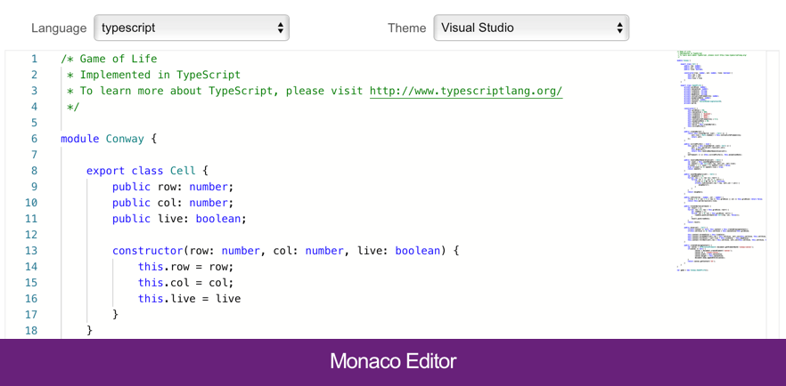

# Monaco Editor

Сейчас мой основной редактор в котором я пишу код – VSCode.
Совсем недавно я обнаружил что Microsoft отдельно предоставляет JS библиотеку Monaco Editor – максимально обрезанную версию VSCode где остались только редактор с мини-картой, подсветка, и куча мелких фишек.

https://github.com/Microsoft/monaco-editor

https://microsoft.github.io/monaco-editor/index.html

Отлично подойдет если вы делаете онлайн-редактор кода, или если нужно показать разницу двух JSON с подсветкой. Советовать можно тем кто раньше пользовался Code Mirror: https://codemirror.net

#vscode #js
