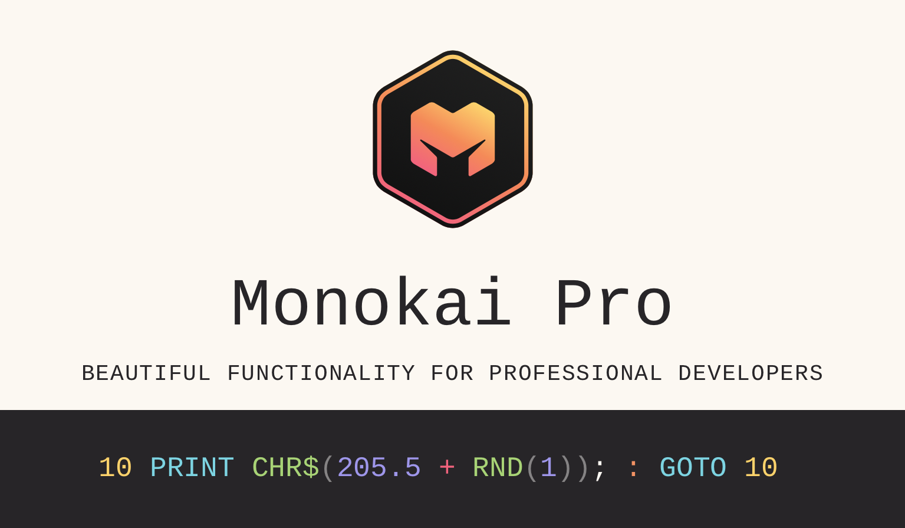

# Monokai Pro

An aesthetically pleasing dark color scheme for VSCode and Sublime.
You can try it for free, but to remove the popup you have to pay €9.95. The theme comes in six variants (https://monokai.pro/vscode) and includes 50+ icons for files.

There are also free analogues for other editors/IDE with the same name, e.g.
https://plugins.jetbrains.com/plugin/13643-monokai-pro.

_Update 2024-01-02_: Monokai Pro inpired theme for Zed editor is called Zedokai.

#vscode #design
