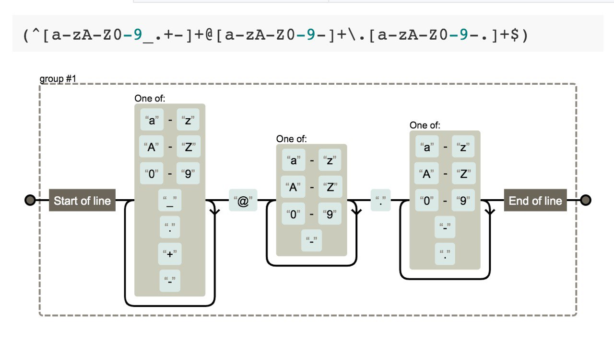

# Regular expressions

In 1943, Warren McCulloch and Walter Pitts published a scientific paper, "The Logical Calculus of Ideas Underlying Nervous Activity," in which they tried to understand brain function by modeling neurons. They didn't know then that their work would have a huge impact on computer science.
https://www.cs.cmu.edu/~./epxing/Class/10715/reading/McCulloch.and.Pitts.pdf

In 1951, American mathematician Stephen Cole Claney, in his paper "Representation of Events in Neural Networks and Finite Automata," proved McCulloch and Pitts' ideas and formalized the definition of a "regular language" – a formal language that can be described by a regular expression.
https://www.rand.org/content/dam/rand/pubs/research_memoranda/2008/RM704.pdf

A little later, in 1968, Ken Thomson (coauthor of Go, by the way) published "Regular Expression Search Algorithm."
https://www.oilshell.org/archive/Thompson-1968.pdf

A regular expression is a pattern/pattern which defines the rules for finding (or replacing) a substring in a string.

Regular expressions can be used to:

- find all character sequences of "cat" in any context, such as "cat", "cattle", "personification";
- find the word "cat" and replace it with "dog";
- find the word "cat" preceded by the word "Persian" or "Cheshire";
- remove from the text all sentences that mention the word "cat" or "dog".

Websites for checking and testing regular expressions:

- https://www.regexpal.com
- https://regexr.com
- https://regex101.com
- https://extendsclass.com/regex-tester.html

And to test your regular expression writing skills, I can advise:

- https://regexcrossword.com – crossword puzzles (there's a mobile version!)
- https://www.hackerrank.com/domains/regex – problems
- https://brilliant.org/practice/regular-expressions – tests

Don't forget two words of wisdom:
"You have a problem. You decided to use regular expressions. Now you have two problems."
"When all you have is a Hammer, everything looks like a Nail".
