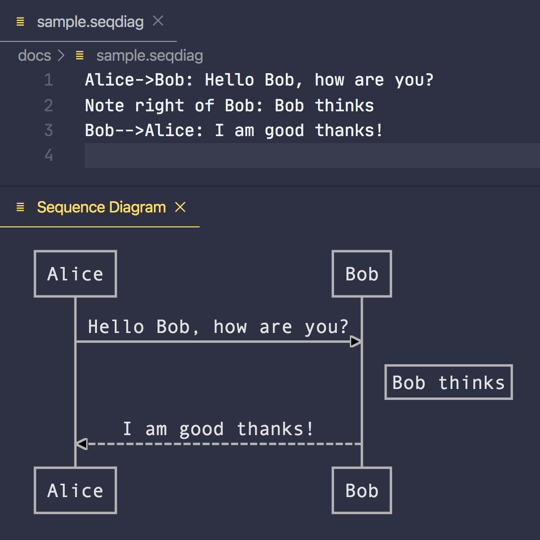

# Sequence Diagrams

В язык UML входят «диаграммы последовательности», с помощью которых можно показать порядок взаимодействия нескольких объектов.
https://www.uml-diagrams.org/sequence-diagrams.html

Andrew Brampton написал JS библиотеку для генерации таких диаргамм из текста: https://bramp.github.io/js-sequence-diagrams/

А на основе этого проекта Aleksandar Toplek из Хорватии сделал расширение для VSCode:
https://marketplace.visualstudio.com/items?itemName=AleksandarDev.vscode-sequence-diagrams



Не забудьте настроить стиль в `settings.json`:
```json
"sequencediagrams.diagram.style": "simple"
```

#vscode #visualization
