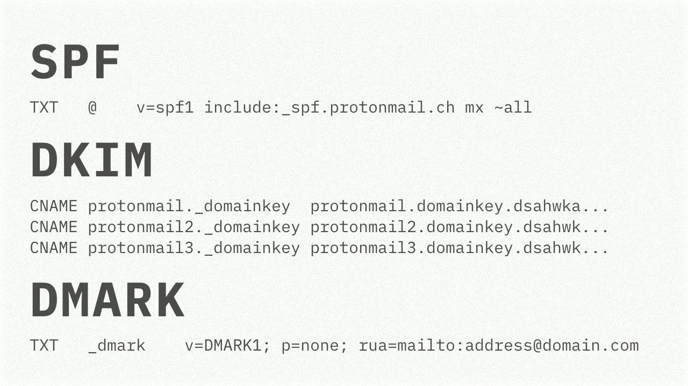

# SPF, DKIM, DMARK

When setting up a custom domain for your email, it is strictly recommended and strongly advised to configure several mechanisms:

SPF (Sender Policy Framework) – the DNS record specifies which hosts/IPs can send mail "on your behalf."
https://tools.ietf.org/html/rfc7208

DKIM (DomainKeys Identified Mail) – allows you to "protect" the mail from changes from the outside: the content of the email is signed with the private key when sending.
The public key is "published" in the DNS record.
https://tools.ietf.org/html/rfc6376

The email server does these checks, and if the checks fail, it will send a report in a standard format to the address specified in DMARK DNS record (Domain-based Message Authentication, Reporting and Conformance).
https://tools.ietf.org/html/rfc7489

Wanting to mess with the DMARK reports, I wrote a little library in Go: https://github.com/chuhlomin/dmark-go

#rfc #go
