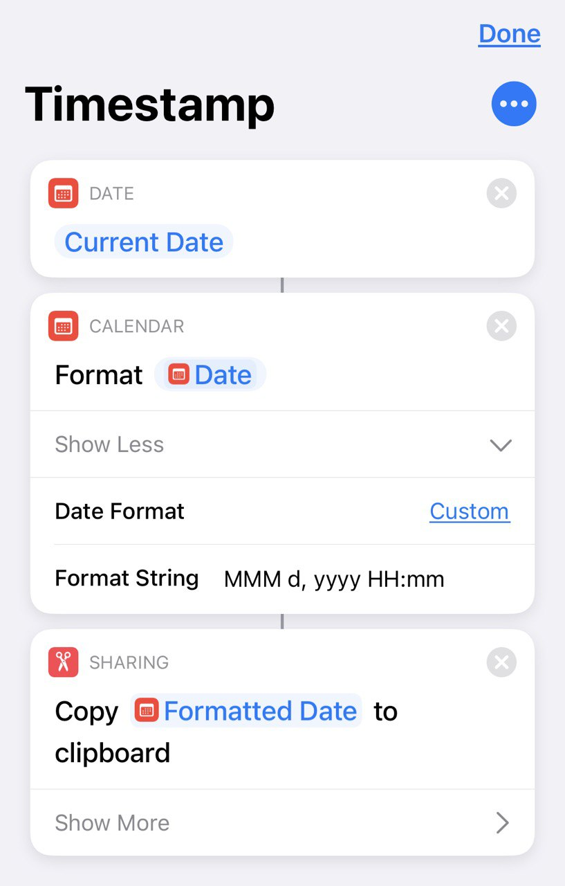

# Timestamp

Как я рассказывал в [заметке про Alfred](alfred_ru.md), я люблю вставлять в тексты метки времени. Они как-то добавляют контекста. Например, при поиске бага я записываю свои рассуждения и попытки по шагам, чтобы, если меня прервут, я смог бы быстро восстановить контекст по шагам.

Вручную эти метки вводить долго, поэтому на маке я для этого пользуюсь комбинацией клавиш.

А на iPhone с iOS 14 теперь можно провернуть такую штуку: настроить выполнение скрипта (Siri Shortcut) по двойному/тройному тапу по задней стенке телефона (Settings / Accessibility / Touch / Back Tap). Вызываемый Shortcut получает текущую дату и копирует её в буфер обмена. Остаётся только вставить дату в заметку вручную.

<video width="353" height="379" controls>
  <source src="timestamp.mp4" type="video/mp4">
</video>

Альтернатива: https://timingapp.com/

#ios #timestamp
