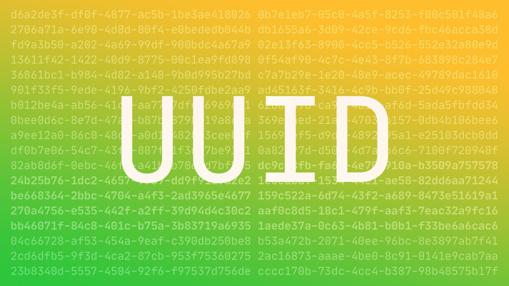

# UUID

UUID - Universally Unique IDentifier (also known as Globally Unique IDentifier - GUID).  
The specification (2005) describes how to quickly generate a fixed-length identifier (128 bits) that is reasonably unlikely to ever be re-created.  
The most simplified explanation: it solves the problem when Alice and Bob, without communicating with each other, need to regularly name a number each so that they never match the one already named.  
https://tools.ietf.org/html/rfc4122

This identifier looks like this, for example: `19dcb23f-a39f-4307-8d76-835ff1556e47`. 
Pay attention to the 4 in the third block, it indicates the fourth version of the UUID, based on the pseudo-random sequence.  
For another person to accidentally get the exact same UUID would have to generate one billion UUIDs per second for 85 years.  
https://en.wikipedia.org/wiki/Universally_unique_identifier

#rfc
