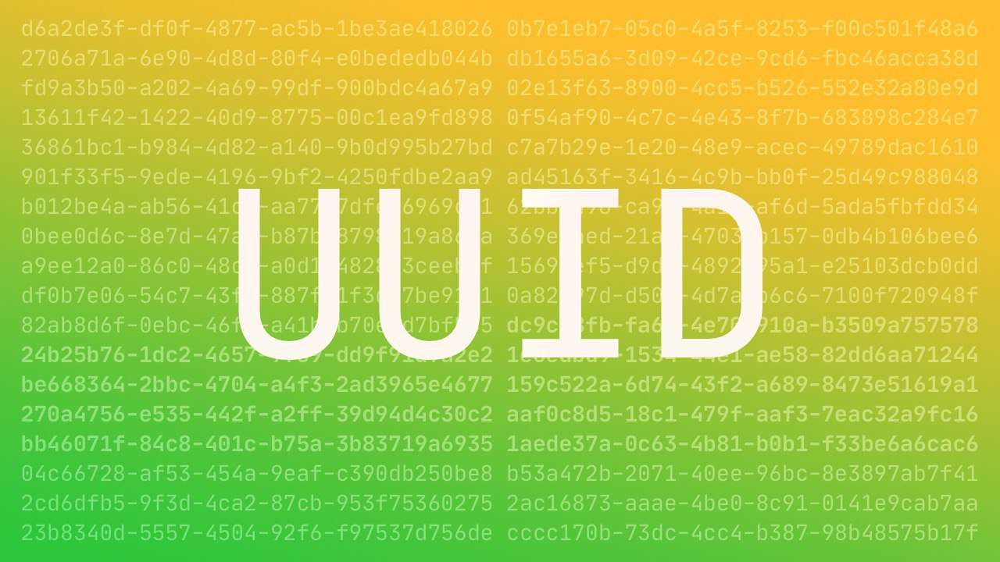

# UUID

Пришла пора рассказать про UUID – Universally Unique IDentifier (также известный как Globally Unique IDentifier – GUID).  
В спецификации (2005 год) описывается как быстро сгенерировать такой идентификатор фиксированный длинны (128 бит), который с достаточной вероятностью не повторится никогда.  
Максимально упрощенное объяснение: это решает проблему когда Алисе и Бобу, не общаясь между собой, нужно регулярно называть по числу так, чтобы они никогда не совпали с уже названными.  
https://tools.ietf.org/html/rfc4122

Выглядит такой идентификатор, например, вот так: `19dcb23f-a39f-4307-8d76-835ff1556e47`.  
Обратите внимание на 4-ку в третем блоке, она указывает на версию UUID – четвертую, основанную на пседво-случайной последовательности.  
Чтобы другой человек случайно получил точно такой же UUID придётся генерировать по одному миллиарду UUID в секунду 85 лет.  
https://en.wikipedia.org/wiki/Universally_unique_identifier

#rfc
