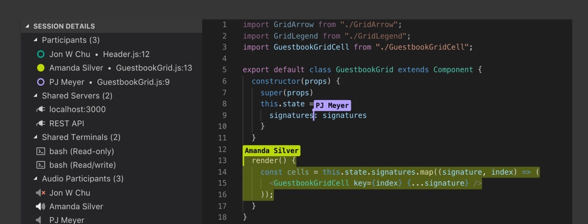

# VSCode Live Share

I recently had a chance to try Live Share in VSCode - a kind of Google Docs for collaborative work with code.

https://visualstudio.microsoft.com/services/live-share/

After logging in via GitHub or a Microsoft account with this extension, you can start a "Live session" and send your colleague a link.  
Your colleague connects to the session and gets access to the project files from his editor (with his customized hotkeys): VSCode or Visual Studio.

It's not perfect but it's good enough to use.  
As an add-on, extensions are offered to add chat and audio communication.

Since March they are testing the connection to the Live Share session from the browser.

Introductory video and description:  
https://code.visualstudio.com/blogs/2017/11/15/live-share

Possible applications:  
https://docs.microsoft.com/en-us/visualstudio/liveshare/reference/use-cases

#vscode
