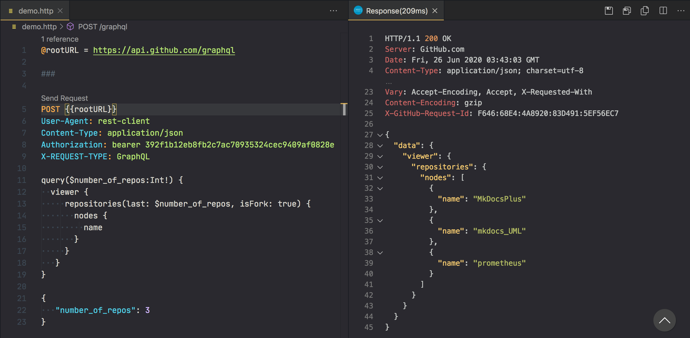

# VSCode REST Client

Huachao Mao has made an interesting extension for VSCode: the REST Client.

https://marketplace.visualstudio.com/items?itemName=humao.rest-client

In a separate file with a .http or .rest extension, you can describe your simple requests and submit them without leaving the editor.  
There is syntax highlighting, support for GraphQL, multipart/form-data, and specifying files as the request body.
There is no OAuth support.

https://github.com/Huachao/vscode-restclient (MIT)

#vscode
