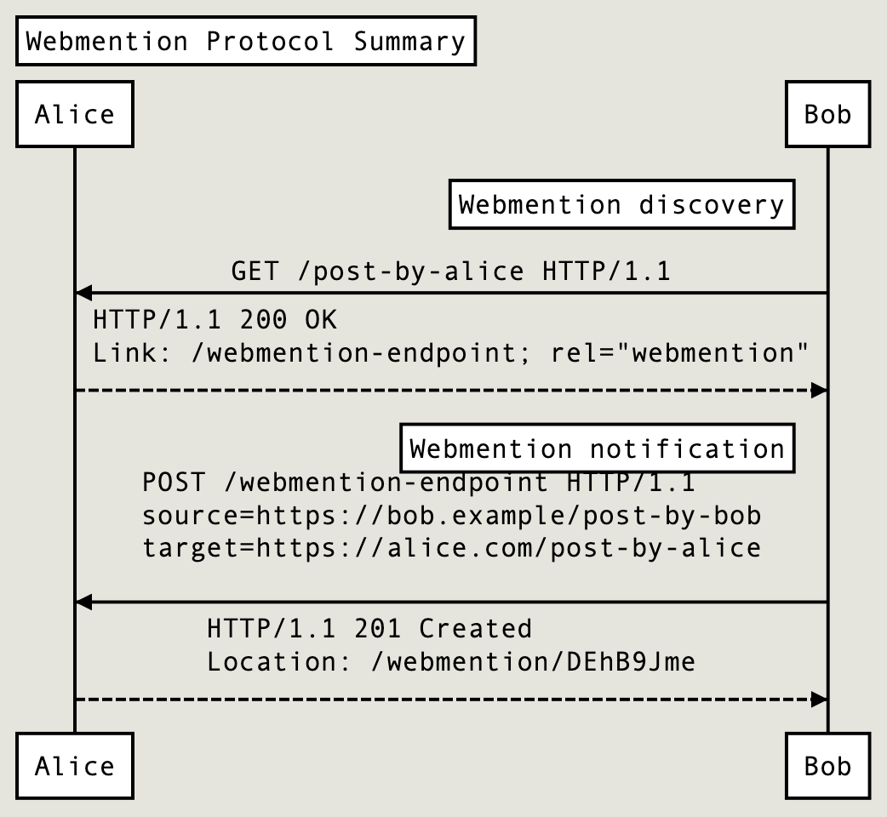

# Webmention

The Webmention specification was published in 2017. It describes a "simple" way to notify one site that another site is linking to a certain page.

https://webmention.net/draft/

For example, Bob writes an article on his blog referencing an article on Alice's blog. The blog engine that Bob uses sends a request to Alice's post page, looking for a link to Webmention service (somewhere in the headers or body of the page). If such a link is found, then a new POST request is sent with links to both blog posts. Alice's blog engine "registers" this notification, optionally notifying "Bob" which link to check webmention processing status.

This all comes from the ideas of a decentralized internet:  
https://indieweb.org/federation

Implementation examples:  
https://indieweb.org/Webmention#IndieWeb_Examples

#rfc
