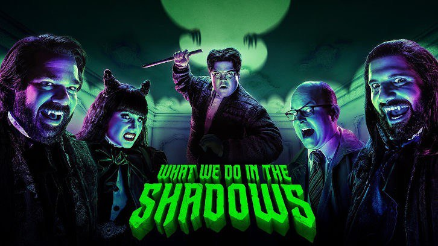

# What we do in the shadows

Another great (so far) series is What we do in the shadows (2019, FX, Hulu).

In 2014, a film of the same name was released in the genre of a mockumentary horror-comedy, where a group of cameramen shoots the everyday life of three vampires in the modern world.

In 2018 New Zealand TV channel TVNZ 2 started a spin-off series, "Wellington Paranormal," about the cops from the movie who investigate paranormal phenomena in the same town. But, unfortunately, it turned out very average, with silly jokes and boring stories.

I, as a fan of the movie, like the new series a lot more. The location was moved from New Zealand to Staten Island (part of New York City). In the foreground: four vampires and a human servant. One of the episodes has a nice "cameo" of vampires from the original film.

There are 10 episodes in the season. ≈ 22 minute episode.  
The series recently began its second season.

Apple TV: https://tv.apple.com/us/show/what-we-do-in-the-shadows/umc.cmc.2bss05wnkfezkywhivjc7ikml

#tvshow
