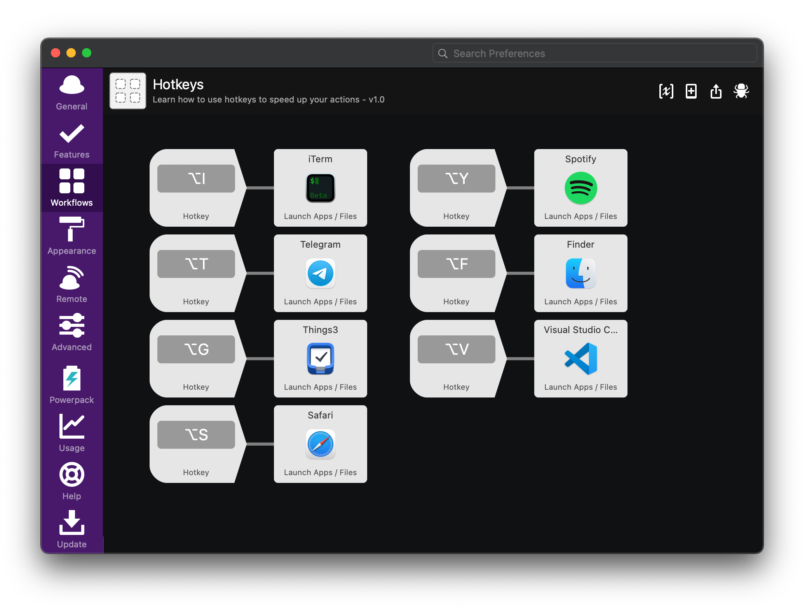

# Alfred Hotkeys Workflow

To move between applications on macOS, you usually use Alt+Tab / Alt+Shift+Tab (faster) or Dock (slower). Frequent tapping on Tab becomes a tedious task, and one would like to press some keyboard shortcut once to go straight to that app.

There are several solutions for this, I settled on Alfred. With the purchase of Powerpack (£29) Workflows become available, where you can do things like launching applications with hotkeys (see screenshot).  
https://www.alfredapp.com/workflows/

As an alternative, you can also try the fresh and free Anykey, with a simple JSON-configuration:  
https://github.com/temochka/Anykey

#alfred #app #macos
