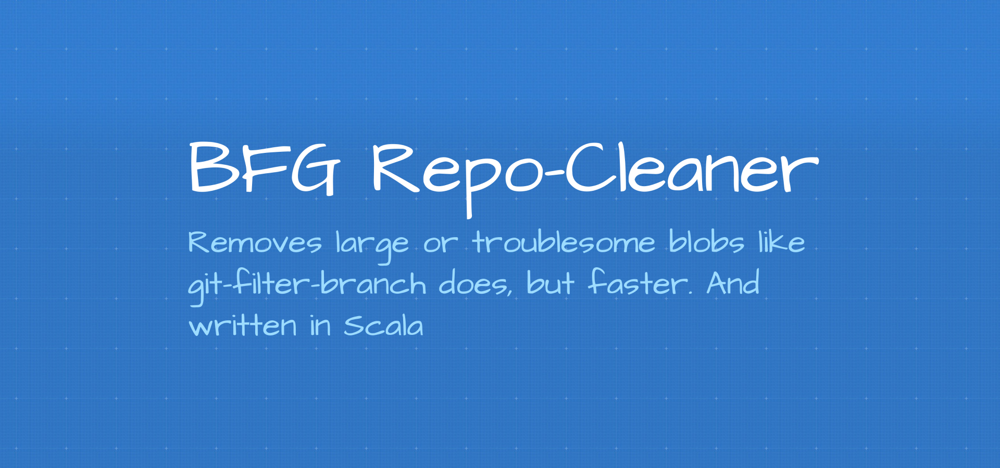

# BFG Repo-Cleaner

Надеюсь, все знают, что хранить секретные значения в открытом виде в Git-репозиториях (даже в приватных) категорически нельзя. Мне приходилось пару раз подчищать такие репозитории. Безусловно, в таких случаях нужно переписывать историю и координировать это всё с командой. Официальная документация предлагает использовать `git-filter-branch`, но есть более быстрый вариант.

Roberto Tyley в 2012 году написал на Скале приложение BFG, которое быстрее `git-filter-branch` в 10–720 раз.
https://rtyley.github.io/bfg-repo-cleaner/



```bash
git clone --mirror git://example.com/some-big-repo.git
java -jar bfg.jar \
    --strip-blobs-bigger-than 100M \
    --replace-text banned.txt
    some-big-repo.git
cd some-big-repo.git
git reflog expire --expire=now --all && \
    git gc --prune=now --aggressive
git push --force
```

Приложение умеет удалять:

- пароли, любые другие секретные значения
- огромные файлы

Перед использованием убедитесь, что всего этого уже нет в текущей версии файлов.

https://github.com/rtyley/bfg-repo-cleaner

#app #cli #git
