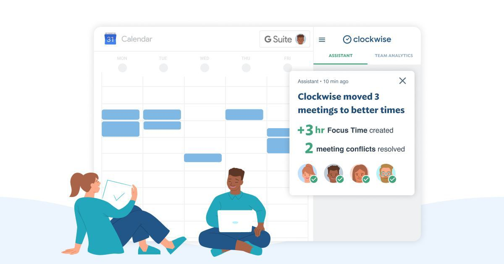

# Clockwise

The meetings culture in most companies is far from satisfactory: a day filled with meetings with 15-30 minute breaks is very common. Even if the break is an hour or two, it's barely enough time to focus on the task, not to mention the productive work.

Clockwise, an add-on service to Google Calendar, tries to solve these problems:

- tells you the best time for the meeting to put it on, so that it does the least amount of damage to the participants' "focus time"
- "autopilot" feature automatically moves the meetings to a better time, taking into account the current calendar and the preferences of your colleagues (working hours, lunch time).

https://www.getclockwise.com

Unfortunately, it only works in Google Chrome (as an extension). It's free for now.  
https://chrome.google.com/webstore/detail/clockwise-time-management/hjcneejoopafkkibfbcaeoldpjjiamog

Closest alternatives: Plan, Planyway.

#service #calendar
