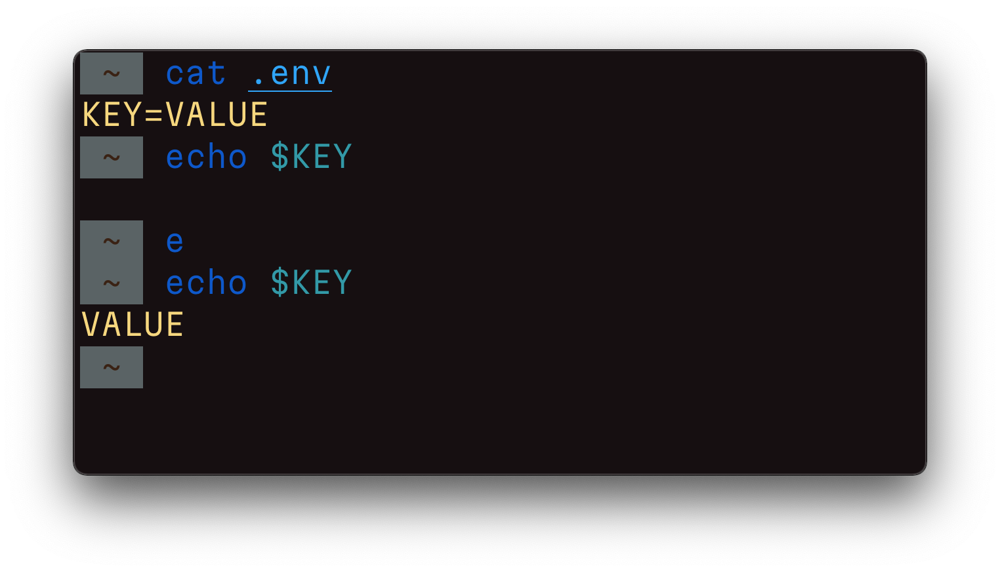

# Переменные окружения и алиас `e`

Переменные это "именованная область памяти". Как символы в математической формуле, они могут принимать какие-то значения, и менять их в ходе работы программы.

Перемернные окружения это такие специальные переменные, которые влияют на работу процессов в операционной системе.

В индустрии сложилось, что наиболее распространённый способ описания переменных окружения это `.env` файл, где каждая строчка имеет формат `KEY=VALUE`.

Docker Compose по умолчанию умеет работать с такими файлами:
https://docs.docker.com/compose/env-file/

В консоли для работы предлагается два инструмента:

- `env` – показывает список текущих переменных окружения,
- `export` – позволяет задать значение переменной окружения.

Однако мне не удалось найти простого способа импорта значений из `.env` файла. Голь на выдумку хитра: https://gist.github.com/mihow/9c7f559807069a03e302605691f85572

В bash это можно сделать так: `. .env`. Для fish я сделал небольшой алиас:
https://github.com/chuhlomin/e

#cli #ops
