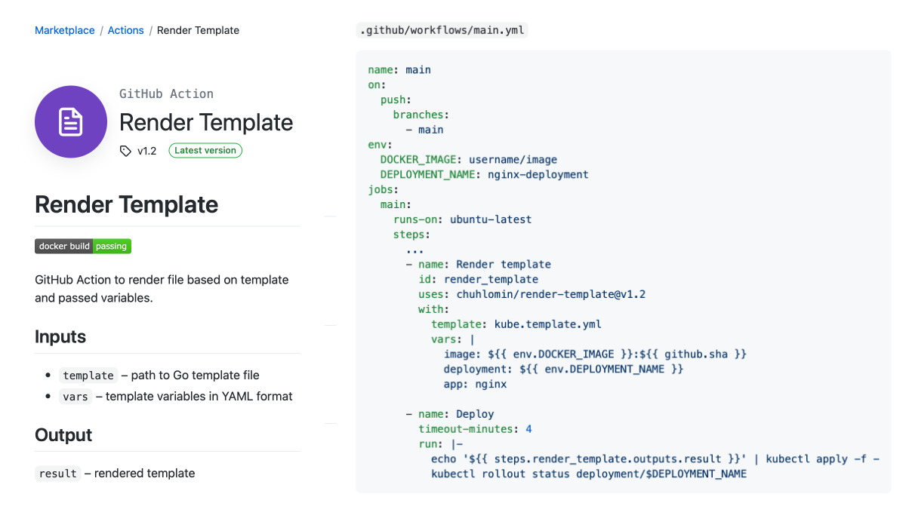

# Render Template

The last weeks have been busy with moves: from New Jersey to New York, from Digital Ocean to Google Cloud (GKE - Google Kubernetes Engine), from Drone CI to GitHub Actions.

To deploy an app to Kubernetes, you usually make a "manifest" template and use some tool to put values into that template: Kustomize, Helm. NYTimes has written their own plugin for this (and more) for Drone CI:  
https://github.com/NYTimes/drone-gke

Since I switched to GitHub Actions and Helm doesn't seem minimalistic enough to me, I wrote my own Action:  
https://github.com/chuhlomin/render-template

Usage example: https://github.com/chuhlomin/timestamp/runs/2372341222

GitHub Marketplace: https://github.com/marketplace/actions/render-template

#project #ops #go
