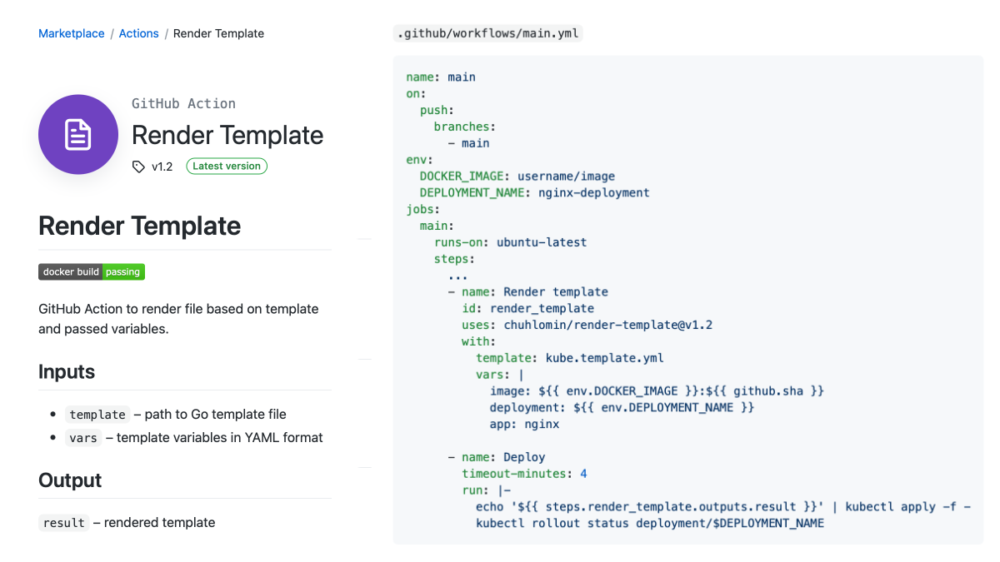

# Render Template

Последние недели я был занят переездами: из Нью Джерси в Нью Йорк, из Digital Ocean в Google Cloud (GKE – Google Kubernetes Engine), с Drone CI на GitHub Actions.

Для деплоя приложения в Kubernetes обычно делают шаблон «манифеста» и используют какой-нибудь инструмент для подстановки значений в этот шаблон: Kustomize, Helm. В NYTimes для этого (и не только) написали свой плагин для Drone CI:  
https://github.com/NYTimes/drone-gke

Так как я перешёл на GitHub Actions, а Helm мне не кажется достаточно минималистичным, я написал свой Action:  
https://github.com/chuhlomin/render-template

GitHub Marketplace: https://github.com/marketplace/actions/render-template

#project #ops #go
