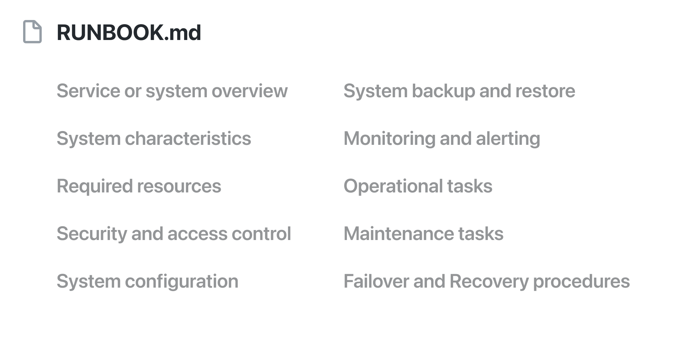

# Runbook

In 2016, the Skelton Thatcher Consulting team published a systems manual template - Runbook:  
https://github.com/SkeltonThatcher/run-book-template/blob/master/run-book-template.md

Such document is put in the project repository, named like RUNBOOK.md, and answers basic questions: what kind of project it is, why the company needs it, what external dependencies it has, how to monitor, how to deploy, what are the problems and how to solve them, and so on. I have already converted several projects to it, and the results continue to please me. You don't have to try to write everything at once, and not all sections may make sense for a particular project.

I also suggest looking at their book "Team Guide to Software Operability" (unfinished):  
http://operabilitybook.com

#ops
