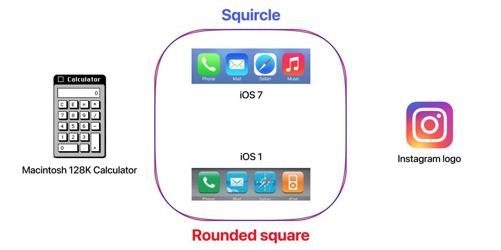
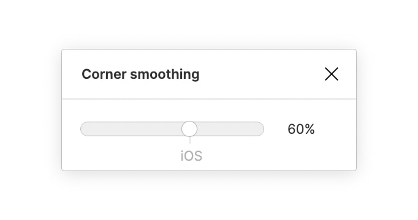

# Squircle

В 1984 вышел первый Mac – Macintosh 128K, в котором впервые появился графический интерфейс. Окна некоторых приложений, да и само верхнее меню было со скруглёнными углами. Известна история где Стив Джобс настоял на этой небольшой детали:  
https://www.folklore.org/StoryView.py?story=Round_Rects_Are_Everywhere.txt

Все иконки в первом iPhone (2007) были квадратными, со скруглёнными углами. Но начиная с iOS 7 (2013, момент отказа от скео-морфизма) Apple сделала скругление углов более плавным. Всё благодаря фигуре squircle – среднее между квадратом и кругом.
Такой изгиб границы визуально кажется более плавным и естественным.  
https://en.wikipedia.org/wiki/Squircle

Иногда его ошибочно принимают за суперэллипс:  
https://en.m.wikipedia.org/wiki/Superellipse

В Figma с недавних пор можно настраивать сглаживание углов.

#design
